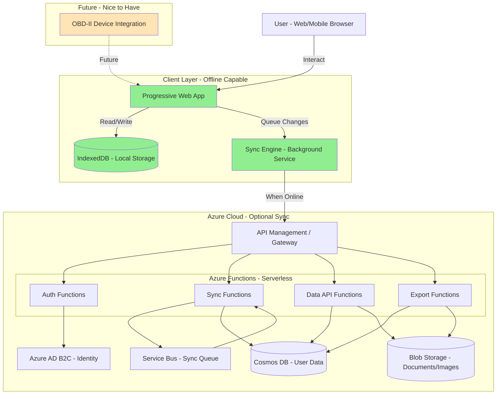

# Vehicle Lifecycle Tracking Application Architecture Document

**Version:** 1.0  
**Date:** January 6, 2026  
**Status:** Draft

---

## Introduction

This document outlines the overall project architecture for Vehicle Lifecycle Tracking Application, including backend systems, shared services, and non-UI specific concerns. Its primary goal is to serve as the guiding architectural blueprint for AI-driven development, ensuring consistency and adherence to chosen patterns and technologies.

**Relationship to Frontend Architecture:**  
If the project includes a significant user interface, a separate Frontend Architecture Document will detail the frontend-specific design and MUST be used in conjunction with this document. Core technology stack choices documented herein (see "Tech Stack") are definitive for the entire project, including any frontend components.

### Starter Template or Existing Project

**Decision:** N/A - Greenfield development from scratch.

**Rationale:** This project will be built from the ground up without relying on existing starter templates or boilerplates. This approach provides maximum flexibility in architecture decisions and allows us to demonstrate the BMAD methodology through complete project structure creation.

### Change Log

| Date | Version | Description | Author |
|------|---------|-------------|--------|
| 2026-01-06 | 1.0 | Initial architecture document creation | Winston (Architect) |

---

## High Level Architecture

### Technical Summary

The Vehicle Lifecycle Tracking Application employs a **hybrid architecture** combining client-side-first design with optional cloud-backed synchronization. The system follows an **offline-first, eventually consistent** pattern where the client (web/mobile) acts as the primary data store using IndexedDB, with Azure serverless backend providing synchronization, backup, and cross-device data availability. The architecture leverages **serverless microservices** on Azure (Functions, Cosmos DB, Blob Storage) to minimize operational overhead and costs while maintaining scalability. Core patterns include **event-driven sync**, **conflict-free replicated data types (CRDT)** for eventual consistency, and **progressive web app (PWA)** capabilities for mobile-like experience on the web. This architecture directly supports the PRD goals of privacy-first operation, offline functionality, and cost-effective cloud usage within Azure free-tier limits.

### High Level Overview

**Architectural Style:** Offline-First Client with Serverless Backend

The system employs a client-heavy architecture where the web/mobile application maintains full operational capability without backend connectivity. All CRUD operations execute against local IndexedDB storage, providing instant response times and eliminating network dependency. 

**Repository Structure:** Monorepo (recommended for solo development and BMAD demonstration)
- Single repository containing frontend, backend functions, and shared types
- Simplified dependency management and atomic cross-stack changes
- Easier demonstration of BMAD methodology with unified project view

**Service Architecture:** Serverless Microservices
- Azure Functions for API endpoints (HTTP triggers)
- Event-driven sync processing (Queue triggers)
- Stateless compute aligns with sporadic sync traffic patterns
- Cost-effective for MVP with burst usage patterns

**Primary User Interaction Flow:**
1. **User Input** → Local IndexedDB (immediate persistence)
2. **Background Process** → Sync Queue (when online)
3. **Azure Functions** → Process sync, detect conflicts, merge changes
4. **Cosmos DB** → Authoritative cloud storage
5. **Blob Storage** → Document/receipt image storage
6. **Sync Response** → Client receives updates from other devices

**Key Architectural Decisions:**

1. **Local-First Storage:** IndexedDB provides structured storage with indexing capabilities, supporting complex queries offline. Chosen over localStorage (size limits) and raw file storage (no query capabilities).

2. **Azure Cosmos DB:** Selected for cloud storage due to global distribution capabilities (future multi-region), flexible schema (JSON documents), and strong consistency options for conflict resolution.

3. **Conflict Resolution Strategy:** Last-Write-Wins (LWW) with vector clocks for most entities. User-driven resolution for critical conflicts (simultaneous edits to same record from different devices).

4. **Authentication:** Azure AD B2C for user management, supporting social logins and providing GDPR-compliant user data management.

### High Level Project Diagram

### Architectural and Design Patterns

- **Offline-First / Local-First Architecture:** Primary pattern for entire application. All data operations succeed without network. Sync is a background enhancement, not a requirement. _Rationale:_ Core PRD requirement (NFR1, NFR2) ensures usability in parking lots, garages, and areas with poor connectivity.

- **Event-Driven Synchronization:** Sync operations triggered by events (connectivity change, user action, timer). Azure Service Bus queues decouple sync requests from processing. Idempotent sync operations allow retry without duplication. _Rationale:_ Handles unreliable mobile connectivity gracefully; allows batching for efficiency; scales to handle sync bursts when users come online.

- **Command Query Responsibility Segregation (CQRS) - Lightweight:** Separate sync write path from read path. Optimistic local writes, eventual consistency with cloud. Read-heavy queries against local IndexedDB. _Rationale:_ Optimizes for read performance (most user interactions), simplifies offline operation, allows independent scaling of sync processing.

- **Repository Pattern:** Abstract data access behind repository interfaces. Repositories handle both IndexedDB and Azure Cosmos DB operations. Enables testing and future storage migrations. _Rationale:_ Clean separation of concerns; testable data layer; consistent API regardless of storage backend.

- **API Gateway Pattern:** Azure API Management as single entry point. Handles authentication, rate limiting, request routing. Provides monitoring and analytics. _Rationale:_ Centralizes cross-cutting concerns; protects backend functions; enables API versioning; can stay within Azure free tier for MVP.

- **Saga Pattern (for Future OBD-II Integration):** Multi-step workflows with compensation logic. Handle long-running OBD-II data sync operations. _Rationale:_ OBD-II integration involves multiple steps (connect, authenticate, fetch data, process, store) that may fail at any point; saga ensures data consistency.

---

## Tech Stack

This is the **DEFINITIVE** technology selection section for the entire project. These choices are the single source of truth that all other documents and development work must reference.

### Cloud Infrastructure

- **Provider:** Microsoft Azure
- **Key Services:** 
  - Azure Functions (Serverless Compute)
  - Azure Cosmos DB (NoSQL Database)
  - Azure Blob Storage (Document Storage)
  - Azure Service Bus (Message Queue)
  - Azure API Management (API Gateway) - Consumption tier
  - Azure AD B2C (Identity)
  - Azure Application Insights (Monitoring)
- **Deployment Regions:** Single region initially (e.g., East US 2 or West Europe), multi-region ready via Cosmos DB global distribution

### Technology Stack Table

| Category | Technology | Version | Purpose | Rationale |
|----------|-----------|---------|---------|-----------|
| **Language** | TypeScript | 5.3.3 | Primary development language | Strong typing prevents sync bugs, shared types across stack |
| **Runtime** | Node.js | 20.11.0 LTS | JavaScript runtime | Long-term support, stable, excellent Azure Functions support |
| **Frontend Framework** | React | 18.2.0 | UI library | Large ecosystem, PWA support, potential React Native path |
| **Frontend Meta-Framework** | Next.js | 14.1.0 | React framework | Built-in routing, SSR capability, optimized builds, PWA support |
| **Backend Framework** | Azure Functions | 4.x | Serverless functions | Native Azure integration, cost-effective, scales to zero |
| **Client Storage** | Dexie.js | 3.2.4 | IndexedDB wrapper | Powerful queries, sync utilities, promise-based API |
| **Database** | Azure Cosmos DB | (Managed Service) | Cloud NoSQL database | Flexible schema, change feed, global distribution ready |
| **Blob Storage** | Azure Blob Storage | (Managed Service) | Document/image storage | Cost-effective, integrates with Functions, supports large files |
| **Message Queue** | Azure Service Bus | (Managed Service) | Async sync processing | Reliable messaging, dead-letter queues, Azure integration |
| **API Gateway** | Azure API Management | Consumption Tier | API gateway | Rate limiting, authentication, monitoring, cost-effective |
| **Authentication** | Azure AD B2C | (Managed Service) | Identity management | GDPR compliant, social logins, user management |
| **Package Manager** | pnpm | 8.15.0 | Dependency management | Fast, disk efficient, monorepo workspaces |
| **Build Tool** | Vite | 5.0.12 | Frontend build tool | Fast HMR, modern ESM, excellent PWA plugin |
| **Monorepo Tool** | Turborepo | 1.12.0 | Monorepo task runner | Build caching, parallel execution, simple config |
| **IaC** | Azure Bicep | 0.24.24 | Infrastructure as Code | Clean syntax, native Azure, type checking |
| **Testing - Unit** | Vitest | 1.2.0 | Unit test runner | Fast, Vite-native, Jest-compatible API |
| **Testing - E2E** | Playwright | 1.41.0 | End-to-end testing | Cross-browser, reliable, good mobile emulation |
| **Linting** | ESLint | 8.56.0 | Code quality | Standard linting, TypeScript support |
| **Formatting** | Prettier | 3.2.4 | Code formatting | Consistent style, integrates with ESLint |
| **State Management** | Zustand | 4.5.0 | Client state | Simple API, TypeScript support, minimal boilerplate |
| **Data Validation** | Zod | 3.22.4 | Schema validation | TypeScript-first, runtime validation, type inference |
| **Date/Time** | date-fns | 3.2.0 | Date manipulation | Tree-shakeable, immutable, comprehensive |
| **HTTP Client** | Fetch API | Native | HTTP requests | Built-in, no dependencies, modern standard |
| **Monitoring** | Azure Application Insights | (Managed Service) | APM & logging | Native Azure, tracks Functions, user analytics |
| **CI/CD** | GitHub Actions | - | Continuous integration | Free for public repos, Azure integration, matrix builds |

---

## Data Models

Based on the PRD requirements and core features, the following entities form the core data model for the Vehicle Lifecycle Tracking Application.

### User

**Purpose:** Represents the application user account. Stores minimal user information for privacy-first approach.

**Key Attributes:**
- `id`: string (UUID) - Unique user identifier
- `email`: string - User email for login and notifications
- `displayName`: string - User's preferred display name
- `createdAt`: DateTime - Account creation timestamp
- `updatedAt`: DateTime - Last profile update timestamp
- `preferences`: object - User preferences (units, currency, locale)
  - `distanceUnit`: enum ('miles', 'kilometers')
  - `fuelVolumeUnit`: enum ('gallons', 'liters')
  - `currency`: string (ISO 4217 code)
  - `locale`: string (BCP 47 language tag)
- `syncEnabled`: boolean - Whether cloud sync is enabled
- `lastSyncAt`: DateTime | null - Last successful sync timestamp

**Relationships:**
- One-to-Many with Vehicle (user owns multiple vehicles)
- One-to-Many with SyncConflict (user may have unresolved conflicts)

### Vehicle

**Purpose:** Represents a vehicle tracked by the user. Central entity for all vehicle-related data.

**Key Attributes:**
- `id`: string (UUID) - Unique vehicle identifier
- `userId`: string (UUID) - Foreign key to User
- `make`: string - Vehicle manufacturer (e.g., "Toyota")
- `model`: string - Vehicle model (e.g., "Camry")
- `year`: number - Model year
- `vin`: string | null - Vehicle Identification Number (optional for privacy)
- `licensePlate`: string | null - License plate number
- `nickname`: string | null - User-assigned name (e.g., "Red Rocket")
- `currentOdometer`: number - Current odometer reading
- `odometerUnit`: enum ('miles', 'kilometers')
- `photoUrl`: string | null - Reference to vehicle photo in Blob Storage
- `purchaseDate`: DateTime | null - Date vehicle was acquired
- `purchasePrice`: number | null - Purchase price
- `notes`: string | null - User notes
- `isActive`: boolean - Whether vehicle is actively tracked (supports archiving sold vehicles)
- `createdAt`: DateTime - Record creation timestamp
- `updatedAt`: DateTime - Last update timestamp
- `lastSyncedAt`: DateTime | null - Last cloud sync timestamp
- `_version`: number - Version number for conflict resolution

**Relationships:**
- Many-to-One with User
- One-to-Many with ServiceEvent
- One-to-Many with FuelEntry
- One-to-Many with InsurancePolicy
- One-to-Many with Document
- One-to-Many with Reminder

### ServiceEvent

**Purpose:** Records maintenance and service activities performed on a vehicle.

**Key Attributes:**
- `id`: string (UUID) - Unique service event identifier
- `vehicleId`: string (UUID) - Foreign key to Vehicle
- `date`: DateTime - Service date
- `odometer`: number - Odometer reading at service
- `serviceType`: enum - Type of service performed
  - 'oil_change', 'tire_rotation', 'brake_service', 'inspection', 'general_maintenance', 'repair', 'upgrade', 'other'
- `description`: string - Service description
- `cost`: number | null - Service cost
- `shopName`: string | null - Service location/shop name
- `shopAddress`: string | null - Shop address
- `notes`: string | null - Additional notes
- `receiptDocumentIds`: string[] - References to Document entities (receipt photos)
- `tags`: string[] - User-defined tags for categorization
- `createdAt`: DateTime - Record creation timestamp
- `updatedAt`: DateTime - Last update timestamp
- `lastSyncedAt`: DateTime | null - Last cloud sync timestamp
- `_version`: number - Version for conflict resolution

**Relationships:**
- Many-to-One with Vehicle
- One-to-Many with Document (receipts)

### FuelEntry

**Purpose:** Records fuel purchases and enables fuel economy tracking.

**Key Attributes:**
- `id`: string (UUID) - Unique fuel entry identifier
- `vehicleId`: string (UUID) - Foreign key to Vehicle
- `date`: DateTime - Fuel purchase date
- `odometer`: number - Odometer reading at fill-up
- `volume`: number - Fuel volume purchased
- `volumeUnit`: enum ('gallons', 'liters')
- `costPerUnit`: number - Price per unit
- `totalCost`: number - Total cost (volume  costPerUnit)
- `isFillUp`: boolean - Whether tank was filled completely (for accurate MPG calculation)
- `stationName`: string | null - Gas station name
- `location`: string | null - Station location
- `fuelGrade`: enum | null - Fuel grade ('regular', 'midgrade', 'premium', 'diesel', 'electric')
- `notes`: string | null - Additional notes
- `receiptDocumentIds`: string[] - References to Document entities
- `createdAt`: DateTime - Record creation timestamp
- `updatedAt`: DateTime - Last update timestamp
- `lastSyncedAt`: DateTime | null - Last cloud sync timestamp
- `_version`: number - Version for conflict resolution

**Relationships:**
- Many-to-One with Vehicle
- One-to-Many with Document (receipts)

### InsurancePolicy

**Purpose:** Stores vehicle insurance policy information and renewal dates.

**Key Attributes:**
- `id`: string (UUID) - Unique insurance policy identifier
- `vehicleId`: string (UUID) - Foreign key to Vehicle
- `provider`: string - Insurance provider name
- `policyNumber`: string - Policy number
- `startDate`: DateTime - Policy effective date
- `endDate`: DateTime - Policy expiration date
- `premium`: number | null - Policy premium amount
- `premiumFrequency`: enum | null - Payment frequency ('monthly', 'quarterly', 'semi-annual', 'annual')
- `coverageType`: string | null - Coverage type description (liability, comprehensive, etc.)
- `deductible`: number | null - Deductible amount
- `notes`: string | null - Additional policy notes
- `documentIds`: string[] - References to Document entities (policy documents)
- `createdAt`: DateTime - Record creation timestamp
- `updatedAt`: DateTime - Last update timestamp
- `lastSyncedAt`: DateTime | null - Last cloud sync timestamp
- `_version`: number - Version for conflict resolution

**Relationships:**
- Many-to-One with Vehicle (vehicle can have policy history)
- One-to-Many with Document (policy documents)

### Document

**Purpose:** Stores references to uploaded documents (receipts, manuals, registration, warranty).

**Key Attributes:**
- `id`: string (UUID) - Unique document identifier
- `vehicleId`: string (UUID) - Foreign key to Vehicle
- `filename`: string - Original filename
- `mimeType`: string - MIME type (image/jpeg, application/pdf, etc.)
- `size`: number - File size in bytes
- `category`: enum - Document category
  - 'receipt', 'manual', 'registration', 'warranty', 'inspection', 'photo', 'other'
- `description`: string | null - User description
- `date`: DateTime | null - Document date (e.g., receipt date)
- `localFileKey`: string - IndexedDB blob key for offline access
- `cloudBlobUrl`: string | null - Azure Blob Storage URL (when synced)
- `thumbnailLocalKey`: string | null - Thumbnail blob key (for images)
- `thumbnailCloudUrl`: string | null - Thumbnail cloud URL
- `linkedEntityType`: enum | null - Type of linked entity ('service', 'fuel', 'insurance', null)
- `linkedEntityId`: string | null - ID of linked entity
- `tags`: string[] - User-defined tags
- `createdAt`: DateTime - Upload timestamp
- `updatedAt`: DateTime - Last update timestamp
- `lastSyncedAt`: DateTime | null - Last cloud sync timestamp
- `_version`: number - Version for conflict resolution

**Relationships:**
- Many-to-One with Vehicle
- Many-to-One with ServiceEvent (optional, via linkedEntityId)
- Many-to-One with FuelEntry (optional, via linkedEntityId)
- Many-to-One with InsurancePolicy (optional, via linkedEntityId)

### Reminder

**Purpose:** Manages maintenance reminders based on odometer or calendar dates.

**Key Attributes:**
- `id`: string (UUID) - Unique reminder identifier
- `vehicleId`: string (UUID) - Foreign key to Vehicle
- `title`: string - Reminder title (e.g., "Oil Change")
- `description`: string | null - Reminder description
- `reminderType`: enum - Type of reminder trigger
  - 'odometer', 'date', 'both'
- `odometerThreshold`: number | null - Odometer value when reminder triggers
- `dateThreshold`: DateTime | null - Date when reminder triggers
- `advanceNoticeOdometer`: number | null - Show reminder X miles/km before threshold
- `advanceNoticeDays`: number | null - Show reminder X days before date
- `repeatInterval`: number | null - Auto-repeat interval (miles/km or days)
- `status`: enum - Reminder status
  - 'active', 'completed', 'snoozed', 'dismissed'
- `completedAt`: DateTime | null - Completion timestamp
- `snoozeUntil`: DateTime | null - Snooze until date
- `linkedServiceType`: enum | null - Related service type (matches ServiceEvent.serviceType)
- `notes`: string | null - Additional notes
- `createdAt`: DateTime - Record creation timestamp
- `updatedAt`: DateTime - Last update timestamp
- `lastSyncedAt`: DateTime | null - Last cloud sync timestamp
- `_version`: number - Version for conflict resolution

**Relationships:**
- Many-to-One with Vehicle

### SyncConflict

**Purpose:** Tracks synchronization conflicts requiring user resolution.

**Key Attributes:**
- `id`: string (UUID) - Unique conflict identifier
- `userId`: string (UUID) - Foreign key to User
- `entityType`: enum - Type of conflicting entity ('vehicle', 'service', 'fuel', 'insurance', 'document', 'reminder')
- `entityId`: string (UUID) - ID of conflicting entity
- `localVersion`: object - Local version of entity (full JSON)
- `cloudVersion`: object - Cloud version of entity (full JSON)
- `localTimestamp`: DateTime - Local last-modified timestamp
- `cloudTimestamp`: DateTime - Cloud last-modified timestamp
- `conflictDetectedAt`: DateTime - When conflict was identified
- `resolutionStrategy`: enum | null - How to resolve ('keep_local', 'keep_cloud', 'merge', 'manual')
- `resolvedAt`: DateTime | null - Resolution timestamp
- `resolvedBy`: enum | null - Resolution actor ('user', 'system_auto')
- `notes`: string | null - Resolution notes

**Relationships:**
- Many-to-One with User

### Data Model Diagram

``mermaid
erDiagram
    User ||--o{ Vehicle : owns
    User ||--o{ SyncConflict : has
    
    Vehicle ||--o{ ServiceEvent : "has history of"
    Vehicle ||--o{ FuelEntry : "has history of"
    Vehicle ||--o{ InsurancePolicy : "has policies for"
    Vehicle ||--o{ Document : "has documents for"
    Vehicle ||--o{ Reminder : "has reminders for"
    
    ServiceEvent ||--o{ Document : "has receipts"
    FuelEntry ||--o{ Document : "has receipts"
    InsurancePolicy ||--o{ Document : "has documents"
    
    User {
        uuid id PK
        string email
        string displayName
        datetime createdAt
        datetime updatedAt
        object preferences
        boolean syncEnabled
        datetime lastSyncAt
    }
    
    Vehicle {
        uuid id PK
        uuid userId FK
        string make
        string model
        number year
        string vin
        string licensePlate
        string nickname
        number currentOdometer
        enum odometerUnit
        string photoUrl
        boolean isActive
        number _version
    }
    
    ServiceEvent {
        uuid id PK
        uuid vehicleId FK
        datetime date
        number odometer
        enum serviceType
        string description
        number cost
        string shopName
        array receiptDocumentIds
        number _version
    }
    
    FuelEntry {
        uuid id PK
        uuid vehicleId FK
        datetime date
        number odometer
        number volume
        enum volumeUnit
        number costPerUnit
        number totalCost
        boolean isFillUp
        enum fuelGrade
        number _version
    }
    
    InsurancePolicy {
        uuid id PK
        uuid vehicleId FK
        string provider
        string policyNumber
        datetime startDate
        datetime endDate
        number premium
        enum premiumFrequency
        number _version
    }
    
    Document {
        uuid id PK
        uuid vehicleId FK
        string filename
        string mimeType
        enum category
        string localFileKey
        string cloudBlobUrl
        enum linkedEntityType
        uuid linkedEntityId
        number _version
    }
    
    Reminder {
        uuid id PK
        uuid vehicleId FK
        string title
        enum reminderType
        number odometerThreshold
        datetime dateThreshold
        number repeatInterval
        enum status
        datetime completedAt
        number _version
    }
    
    SyncConflict {
        uuid id PK
        uuid userId FK
        enum entityType
        uuid entityId
        object localVersion
        object cloudVersion
        enum resolutionStrategy
        datetime resolvedAt
    }
``

---

## Components

Based on the architectural patterns, tech stack, and data models, the following major logical components comprise the system. Given the monorepo structure, these components will be organized as packages within the repository.

### Web Application (packages/web)

**Responsibility:** Primary user interface for vehicle lifecycle tracking. Progressive Web App providing offline-first experience with responsive design for desktop and mobile browsers.

**Key Interfaces:**
- **Public Routes:** `/`, `/login`, `/register`, `/vehicles`, `/vehicles/:id`, `/entries`, `/reminders`, `/reports`, `/settings`
- **Service Worker API:** Background sync, offline caching, push notifications
- **IndexedDB API:** Local data storage via Dexie.js
- **Backend API Client:** HTTP communication with Azure Functions

**Dependencies:**
- `packages/shared` (shared types and utilities)
- `packages/sync-engine` (synchronization logic)
- Azure API Management (when online)

**Technology Stack:**
- Next.js 14.1.0 (React meta-framework)
- React 18.2.0 (UI library)
- Zustand 4.5.0 (state management)
- Dexie.js 3.2.4 (IndexedDB)
- Zod 3.22.4 (validation)

### Sync Engine (packages/sync-engine)

**Responsibility:** Manages bidirectional synchronization between local IndexedDB and Azure Cosmos DB. Handles conflict detection, resolution, and retry logic.

**Key Interfaces:**
- `SyncManager.sync()` - Trigger full sync cycle
- `SyncManager.pushChanges()` - Push local changes to cloud
- `SyncManager.pullChanges()` - Pull cloud changes to local
- `ConflictResolver.resolve()` - Handle sync conflicts
- `SyncQueue.enqueue()` - Add operation to sync queue
- Event emitters for sync progress/status

**Dependencies:**
- `packages/shared` (data models, types)
- Dexie.js (local storage access)
- Azure API Management (cloud access)

**Technology Stack:**
- TypeScript 5.3.3
- RxJS (for observable sync streams)
- Dexie.js sync utilities

### Backend API (packages/api)

**Responsibility:** Azure Functions providing serverless HTTP endpoints for authentication, data sync, and cloud operations.

**Key Interfaces:**
- `POST /api/auth/register` - User registration
- `POST /api/auth/login` - User authentication
- `POST /api/sync/push` - Accept client changes
- `GET /api/sync/pull?since={timestamp}` - Retrieve cloud changes
- `GET /api/sync/conflicts` - List unresolved conflicts
- `POST /api/sync/resolve` - Resolve conflict
- `POST /api/documents/upload` - Upload document to Blob Storage
- `GET /api/documents/:id` - Retrieve document URL
- `POST /api/export/pdf` - Generate PDF report
- `POST /api/export/csv` - Generate CSV export
- `GET /api/user/data` - Export all user data (GDPR)
- `DELETE /api/user/data` - Delete all user data (GDPR)

**Dependencies:**
- `packages/shared` (data models, validation schemas)
- Azure Cosmos DB (data storage)
- Azure Blob Storage (document storage)
- Azure Service Bus (async processing)
- Azure AD B2C (authentication)

**Technology Stack:**
- Node.js 20.11.0 LTS
- Azure Functions 4.x
- @azure/cosmos (Cosmos DB SDK)
- @azure/storage-blob (Blob Storage SDK)
- @azure/service-bus (Service Bus SDK)
- Zod 3.22.4 (request validation)

### Sync Worker (packages/sync-worker)

**Responsibility:** Background Azure Functions triggered by Service Bus messages for async sync processing. Handles batch operations and long-running tasks.

**Key Interfaces:**
- Service Bus Queue Trigger: `sync-queue`
- Service Bus Topic Trigger: `conflict-notifications`
- Timer Trigger: Cleanup stale sync operations

**Dependencies:**
- `packages/shared` (data models)
- Azure Cosmos DB
- Azure Service Bus

**Technology Stack:**
- Node.js 20.11.0 LTS
- Azure Functions 4.x
- @azure/cosmos
- @azure/service-bus

### Shared Package (packages/shared)

**Responsibility:** Shared TypeScript types, data models, validation schemas, and utilities used across all packages.

**Key Interfaces:**
- Type definitions for all data models (User, Vehicle, ServiceEvent, etc.)
- Zod validation schemas for all entities
- Utility functions (date formatting, unit conversion, etc.)
- Constants (enums, configuration)
- API response types

**Dependencies:**
- None (dependency-free for maximum reusability)

**Technology Stack:**
- TypeScript 5.3.3
- Zod 3.22.4 (schema definitions)
- date-fns 3.2.0 (date utilities)

### Infrastructure (packages/infrastructure)

**Responsibility:** Azure Bicep templates defining all cloud infrastructure as code.

**Key Interfaces:**
- `main.bicep` - Root infrastructure definition
- `modules/` - Modular Bicep resources

**Dependencies:**
- None (infrastructure definition)

**Technology Stack:**
- Azure Bicep 0.24.24

### Component Interaction Diagram

``mermaid
graph TB
    subgraph "Client - Browser/PWA"
        WebApp[Web Application packages/web]
        SyncEngine[Sync Engine packages/sync-engine]
        IndexDB[(IndexedDB Local Storage)]
    end
    
    subgraph "Azure Cloud"
        APIM[API Management Gateway]
        
        subgraph "Serverless Functions"
            BackendAPI[Backend API packages/api HTTP Triggers]
            SyncWorker[Sync Worker packages/sync-worker Queue/Timer Triggers]
        end
        
        ServiceBus[Service Bus Async Queue]
        CosmosDB[(Cosmos DB Cloud Storage)]
        BlobStorage[(Blob Storage Documents)]
        ADB2C[Azure AD B2C Identity]
    end
    
    subgraph "Shared Code"
        SharedPkg[Shared Package packages/shared Types & Utilities]
    end
    
    WebApp --> SyncEngine
    WebApp --> IndexDB
    SyncEngine --> IndexDB
    
    SyncEngine -->|HTTPS| APIM
    WebApp -->|Auth| ADB2C
    
    APIM --> BackendAPI
    BackendAPI --> ADB2C
    BackendAPI --> CosmosDB
    BackendAPI --> BlobStorage
    BackendAPI -->|Queue Messages| ServiceBus
    
    ServiceBus -->|Trigger| SyncWorker
    SyncWorker --> CosmosDB
    SyncWorker --> ServiceBus
    
    WebApp -.->|Uses| SharedPkg
    SyncEngine -.->|Uses| SharedPkg
    BackendAPI -.->|Uses| SharedPkg
    SyncWorker -.->|Uses| SharedPkg
    
    style WebApp fill:#90EE90
    style SyncEngine fill:#90EE90
    style IndexDB fill:#90EE90
    style SharedPkg fill:#FFE4B5
``

---

## External APIs

Based on the PRD requirements and feature set, the MVP does not require external API integrations for core functionality. All core features operate entirely on local and Azure infrastructure without third-party dependencies.

### Current MVP: No External APIs Required

The core MVP features (vehicle management, service logging, fuel tracking, insurance, documents, reminders, reports) operate entirely on local and Azure infrastructure without requiring third-party APIs.

**Rationale:**
- Privacy-first approach minimizes data sharing with external services
- Offline-first architecture cannot depend on external API availability
- Cost control during MVP phase
- Simplifies GDPR compliance

### Future Integration: OBD-II Device APIs (Post-MVP Priority)

**Purpose:** Automatic vehicle data capture including mileage, diagnostics, fuel consumption, and maintenance alerts.

**Documentation:** 
- OBD-II Bluetooth/WiFi adapter specifications (various vendors)
- Common protocols: ISO 15031-5, ISO 14229, ISO 15765-4
- Web Bluetooth API: https://developer.mozilla.org/en-US/docs/Web/API/Web_Bluetooth_API

**Base URL(s):** N/A (direct device-to-browser via Web Bluetooth)

**Authentication:** None (direct device connection with user permission)

**Rate Limits:** Device-dependent (typically poll every 100-500ms max)

**Key Endpoints Used:**
- OBD-II PID `0x01 0x0C` - Engine RPM
- OBD-II PID `0x01 0x0D` - Vehicle Speed
- OBD-II PID `0x01 0x2F` - Fuel Level
- OBD-II PID `0x01 0x31` - Distance since codes cleared (approximates odometer)
- OBD-II PID `0x01 0x03` - Diagnostic Trouble Codes (DTCs)
- OBD-II PID `0x09 0x02` - VIN (Vehicle Identification Number)

**Integration Notes:**
- Web Bluetooth requires HTTPS and explicit user permission
- Browser support: Chrome/Edge (full), Safari/Firefox (limited/none)
- All OBD-II data stays local unless user enables cloud sync
- Automatic fuel entry creation when fuel level drop + odometer increase detected
- Automatic maintenance reminders triggered by DTCs
- Fallback: Manual entry always available

---

## Core Workflows

The following sequence diagrams illustrate critical user journeys and system interactions, clarifying how components collaborate to deliver core functionality.

### Workflow 1: User Registration and First-Time Setup

``mermaid
sequenceDiagram
    actor User
    participant WebApp
    participant ADB2C
    participant BackendAPI
    participant CosmosDB
    participant IndexDB
    
    User->>WebApp: Click "Sign Up"
    WebApp->>ADB2C: Redirect to registration
    User->>ADB2C: Enter email/password
    ADB2C->>ADB2C: Create account
    ADB2C-->>WebApp: Redirect with auth token
    
    WebApp->>BackendAPI: POST /api/user/register
    Note over WebApp,BackendAPI: Send token + preferences
    BackendAPI->>BackendAPI: Validate token
    BackendAPI->>CosmosDB: Create User record
    CosmosDB-->>BackendAPI: Success
    BackendAPI-->>WebApp: User profile + settings
    
    WebApp->>IndexDB: Initialize local database
    WebApp->>IndexDB: Store user profile
    WebApp->>User: Show welcome + add first vehicle
``

### Workflow 2: Add Vehicle and First Service Entry (Offline)

``mermaid
sequenceDiagram
    actor User
    participant WebApp
    participant IndexDB
    participant SyncEngine
    
    User->>WebApp: Navigate to "Add Vehicle"
    WebApp->>User: Show vehicle form
    User->>WebApp: Enter make, model, year, odometer
    WebApp->>WebApp: Validate with Zod schema
    
    WebApp->>IndexDB: INSERT Vehicle
    IndexDB-->>WebApp: Vehicle created (UUID)
    WebApp->>SyncEngine: Enqueue vehicle for sync
    SyncEngine->>IndexDB: Mark _version=1, lastSyncedAt=null
    WebApp->>User: Success (offline indicator visible)
    
    User->>WebApp: Add first service entry
    WebApp->>User: Show service form (odometer pre-filled)
    User->>WebApp: Enter oil change, dollar45, shop name
    WebApp->>IndexDB: INSERT ServiceEvent
    IndexDB-->>WebApp: Service created
    WebApp->>SyncEngine: Enqueue service for sync
    WebApp->>IndexDB: Update vehicle.currentOdometer
    WebApp->>User: Success + view history
    
    Note over User,SyncEngine: All data safe locally, app fully functional offline
``

### Workflow 3: Background Sync - Push Local Changes

``mermaid
sequenceDiagram
    participant SyncEngine
    participant IndexDB
    participant APIM
    participant BackendAPI
    participant CosmosDB
    participant ServiceBus
    
    Note over SyncEngine: Detects network connectivity
    SyncEngine->>SyncEngine: Timer triggers sync check
    SyncEngine->>IndexDB: Query entities where lastSyncedAt IS NULL
    IndexDB-->>SyncEngine: [Vehicle, ServiceEvent] pending
    
    SyncEngine->>APIM: POST /api/sync/push
    Note over SyncEngine,APIM: Batch: [Vehicle, ServiceEvent]
    APIM->>APIM: Validate auth token
    APIM->>BackendAPI: Forward request
    
    BackendAPI->>CosmosDB: BEGIN transaction
    
    loop For each entity
        BackendAPI->>CosmosDB: Check if exists by ID
        
        alt Entity not exists (CREATE)
            BackendAPI->>CosmosDB: INSERT entity
            CosmosDB-->>BackendAPI: Success
        else Entity exists (UPDATE)
            BackendAPI->>CosmosDB: Read current _version
            
            alt No version conflict
                BackendAPI->>CosmosDB: UPDATE entity (_version++)
                CosmosDB-->>BackendAPI: Success
            else Version conflict detected
                BackendAPI->>CosmosDB: CREATE SyncConflict
                BackendAPI->>ServiceBus: Queue conflict notification
                Note over BackendAPI: Skip update, conflict requires resolution
            end
        end
    end
    
    BackendAPI->>CosmosDB: COMMIT transaction
    BackendAPI-->>APIM: Success response with timestamps
    APIM-->>SyncEngine: Success
    
    SyncEngine->>IndexDB: UPDATE lastSyncedAt for synced entities
    SyncEngine->>SyncEngine: Emit "sync-complete" event
    Note over SyncEngine: WebApp shows "Synced" indicator
``

### Workflow 4: Document Upload with Sync

``mermaid
sequenceDiagram
    actor User
    participant WebApp
    participant IndexDB
    participant APIM
    participant BackendAPI
    participant BlobStorage
    participant CosmosDB
    
    User->>WebApp: Select receipt photo for service
    WebApp->>WebApp: Read file, generate thumbnail
    WebApp->>WebApp: Generate UUID for document
    
    WebApp->>IndexDB: Store file blob in IndexedDB.files
    IndexDB-->>WebApp: Blob key
    WebApp->>IndexDB: Store thumbnail blob
    IndexDB-->>WebApp: Thumbnail key
    
    WebApp->>IndexDB: INSERT Document metadata
    Note over WebApp,IndexDB: localFileKey set, cloudBlobUrl=null
    IndexDB-->>WebApp: Success
    
    WebApp->>User: Show document in gallery (from IndexedDB)
    
    Note over WebApp: When online...
    
    WebApp->>APIM: POST /api/documents/upload
    Note over WebApp,APIM: Multipart: file + thumbnail + metadata
    APIM->>BackendAPI: Forward upload
    
    BackendAPI->>BlobStorage: Upload file to container
    Note over BackendAPI,BlobStorage: Path: userId/vehicleId/documentId.jpg
    BlobStorage-->>BackendAPI: Blob URL
    
    BackendAPI->>BlobStorage: Upload thumbnail
    BlobStorage-->>BackendAPI: Thumbnail URL
    
    BackendAPI->>CosmosDB: INSERT/UPDATE Document metadata
    Note over BackendAPI,CosmosDB: Store cloudBlobUrl + thumbnailCloudUrl
    CosmosDB-->>BackendAPI: Success
    
    BackendAPI-->>APIM: Document URLs
    APIM-->>WebApp: Success response
    
    WebApp->>IndexDB: UPDATE Document with cloud URLs
    Note over WebApp: Now available from any device via sync
``

### Workflow 5: Fuel Economy Calculation

``mermaid
sequenceDiagram
    actor User
    participant WebApp
    participant IndexDB
    
    User->>WebApp: Add fuel entry (fill-up)
    WebApp->>User: Show form
    User->>WebApp: 12.5 gallons, dollar46.25, odometer 45123
    WebApp->>WebApp: Set isFillUp = true
    
    WebApp->>IndexDB: Query previous fill-up for vehicle
    Note over WebApp,IndexDB: WHERE isFillUp=true ORDER BY date DESC LIMIT 1
    IndexDB-->>WebApp: Previous: 44823 miles, date 2026-01-01
    
    WebApp->>WebApp: Calculate MPG
    Note over WebApp: Distance: 45123 - 44823 = 300 miles Volume: 12.5 gallons MPG: 300 / 12.5 = 24.0
    
    WebApp->>IndexDB: INSERT FuelEntry with calculated context
    WebApp->>IndexDB: Query last 10 fill-ups
    IndexDB-->>WebApp: Fuel history
    
    WebApp->>WebApp: Calculate average MPG
    WebApp->>User: Show "24.0 MPG this tank, 23.5 avg last 10"
    
    WebApp->>User: Chart: MPG trend over time
``

---

## Database Schema

This section transforms the conceptual data models into concrete database schemas for both IndexedDB (client-side) and Azure Cosmos DB (cloud-side).

### IndexedDB Schema (Client-Side)

**Database Name:** `vehicle-tracker`  
**Version:** 1

**Object Stores (Tables):**

``typescript
// Dexie.js schema definition
const db = new Dexie('vehicle-tracker');

db.version(1).stores({
  users: 'id, email, lastSyncAt',
  vehicles: 'id, userId, isActive, currentOdometer, [userId+isActive]',
  serviceEvents: 'id, vehicleId, date, odometer, serviceType, [vehicleId+date]',
  fuelEntries: 'id, vehicleId, date, odometer, isFillUp, [vehicleId+date], [vehicleId+isFillUp]',
  insurancePolicies: 'id, vehicleId, endDate, [vehicleId+endDate]',
  documents: 'id, vehicleId, category, date, linkedEntityType, linkedEntityId, [vehicleId+category]',
  reminders: 'id, vehicleId, status, odometerThreshold, dateThreshold, [vehicleId+status]',
  syncConflicts: 'id, userId, entityType, entityId, resolvedAt',
  syncQueue: '++autoId, entityType, entityId, operation, timestamp'
});
``

**Index Rationale:**
- **Primary Keys:** All entities use UUID `id` as primary key
- **Foreign Keys:** `userId`, `vehicleId` indexed for filtering
- **Compound Indexes:** `[userId+isActive]` enables "get active vehicles for user"
- **Query Optimization:** Date and status fields indexed for common queries
- **Sync Queue:** Auto-increment for FIFO processing

**Storage Estimates (MVP User Profile):**
- User: ~1 KB
- Vehicle (5 vehicles): ~5 KB
- ServiceEvents (100 entries): ~50 KB
- FuelEntries (200 entries): ~40 KB
- Documents (50 receipts with thumbnails): ~10 MB
- **Total per user:** ~10-15 MB
- **IndexedDB Limit:** 50 MB+ (browser-dependent), sufficient for typical usage

### Azure Cosmos DB Schema (Cloud-Side)

**Database:** `vehicle-tracker-db`  
**API:** Core (SQL)  
**Partition Strategy:** By `userId` for optimal isolation and scaling

**Container Configuration:**
- **Partition Key:** `/userId` on all containers
- **Consistency Level:** Session (read-your-writes guarantee)
- **Change Feed:** Enabled on all containers except sync-conflicts
- **TTL:** 30 days on sync-conflicts after resolution

**Containers:**
- `users` - User accounts and preferences
- `vehicles` - Vehicle registrations
- `service-events` - Maintenance history
- `fuel-entries` - Fuel purchase records
- `insurance-policies` - Insurance information
- `documents` - Document metadata (files in Blob Storage)
- `reminders` - Maintenance reminders
- `sync-conflicts` - Conflict resolution tracking

**Indexing Policy:**
``json
{
  "indexingMode": "consistent",
  "automatic": true,
  "includedPaths": [
    { "path": "/*" }
  ],
  "excludedPaths": [
    { "path": "/localVersion/*" },
    { "path": "/cloudVersion/*" },
    { "path": "/_etag/?" }
  ]
}
``

**Throughput Configuration:**
- **MVP:** Shared database throughput at 400 RU/s (within free tier 1000 RU/s)
- **Production:** Container-level autoscale (400-4000 RU/s)

---

## Database Schema

This section transforms the conceptual data models into concrete database schemas for both IndexedDB (client-side) and Azure Cosmos DB (cloud-side).

### IndexedDB Schema (Client-Side)

**Database Name:** `vehicle-tracker`  
**Version:** 1

**Object Stores (Tables):**

``typescript
// Dexie.js schema definition
const db = new Dexie('vehicle-tracker');

db.version(1).stores({
  users: 'id, email, lastSyncAt',
  vehicles: 'id, userId, isActive, currentOdometer, [userId+isActive]',
  serviceEvents: 'id, vehicleId, date, odometer, serviceType, [vehicleId+date]',
  fuelEntries: 'id, vehicleId, date, odometer, isFillUp, [vehicleId+date], [vehicleId+isFillUp]',
  insurancePolicies: 'id, vehicleId, endDate, [vehicleId+endDate]',
  documents: 'id, vehicleId, category, date, linkedEntityType, linkedEntityId, [vehicleId+category]',
  reminders: 'id, vehicleId, status, odometerThreshold, dateThreshold, [vehicleId+status]',
  syncConflicts: 'id, userId, entityType, entityId, resolvedAt',
  syncQueue: '++autoId, entityType, entityId, operation, timestamp'
});
``

**Index Rationale:**
- **Primary Keys:** All entities use UUID `id` as primary key
- **Foreign Keys:** `userId`, `vehicleId` indexed for filtering
- **Compound Indexes:** `[userId+isActive]` enables "get active vehicles for user"
- **Query Optimization:** Date and status fields indexed for common queries
- **Sync Queue:** Auto-increment for FIFO processing

**Storage Estimates (MVP User Profile):**
- User: ~1 KB
- Vehicle (5 vehicles): ~5 KB
- ServiceEvents (100 entries): ~50 KB
- FuelEntries (200 entries): ~40 KB
- Documents (50 receipts with thumbnails): ~10 MB
- **Total per user:** ~10-15 MB
- **IndexedDB Limit:** 50 MB+ (browser-dependent), sufficient for typical usage

### Azure Cosmos DB Schema (Cloud-Side)

**Database:** `vehicle-tracker-db`  
**API:** Core (SQL)  
**Partition Strategy:** By `userId` for optimal isolation and scaling

**Container Configuration:**
- **Partition Key:** `/userId` on all containers
- **Consistency Level:** Session (read-your-writes guarantee)
- **Change Feed:** Enabled on all containers except sync-conflicts
- **TTL:** 30 days on sync-conflicts after resolution

**Containers:**
- `users` - User accounts and preferences
- `vehicles` - Vehicle registrations
- `service-events` - Maintenance history
- `fuel-entries` - Fuel purchase records
- `insurance-policies` - Insurance information
- `documents` - Document metadata (files in Blob Storage)
- `reminders` - Maintenance reminders
- `sync-conflicts` - Conflict resolution tracking

**Indexing Policy:**
``json
{
  "indexingMode": "consistent",
  "automatic": true,
  "includedPaths": [
    { "path": "/*" }
  ],
  "excludedPaths": [
    { "path": "/localVersion/*" },
    { "path": "/cloudVersion/*" },
    { "path": "/_etag/?" }
  ]
}
``

**Throughput Configuration:**
- **MVP:** Shared database throughput at 400 RU/s (within free tier 1000 RU/s)
- **Production:** Container-level autoscale (400-4000 RU/s)

---

## Source Tree

The following project structure reflects the monorepo organization with clear separation between frontend, backend, shared code, and infrastructure.

``
vehicle-tracker/
 .github/
    workflows/
        ci.yml                          # CI pipeline for tests and linting
        deploy-dev.yml                  # Deploy to dev environment
        deploy-prod.yml                 # Deploy to production

 packages/
    web/                                # Next.js web application (PWA)
       src/
          app/                        # Next.js 14 app directory
             (auth)/                 # Auth route group
                login/
                register/
             (dashboard)/            # Protected routes
                vehicles/
                reminders/
                reports/
                settings/
             layout.tsx              # Root layout
             page.tsx                # Dashboard home
          components/                 # React components
             ui/                     # Base UI components
             forms/                  # Form components
             vehicle/                # Vehicle-specific
             sync/                   # Sync status indicators
          lib/                        # Utilities and clients
             db.ts                   # Dexie.js database setup
│             api-client.ts           # Backend API client
          hooks/                      # Custom React hooks
          stores/                     # Zustand stores
       public/                         # Static assets
          manifest.json               # PWA manifest
          service-worker.js           # Service worker
       tests/
       next.config.js
       tsconfig.json
       package.json
   
    sync-engine/                        # Synchronization logic
       src/
          sync-manager.ts             # Main sync orchestrator
          conflict-resolver.ts        # Conflict resolution
          sync-queue.ts               # Operation queue
          push-sync.ts                # Push to cloud
          pull-sync.ts                # Pull from cloud
       tests/
       tsconfig.json
       package.json
   
    api/                                # Azure Functions (Backend API)
       src/
          functions/
             auth/                   # Authentication endpoints
             sync/                   # Sync endpoints
             documents/              # Document management
             export/                 # Report generation
             user/                   # User data (GDPR)
          lib/                        # Shared function utilities
       tests/
       host.json
       tsconfig.json
       package.json
   
    sync-worker/                        # Azure Functions (Background Worker)
       src/
          functions/
             process-sync-queue.ts   # Queue trigger
             change-feed-handler.ts  # Cosmos change feed
             cleanup-conflicts.ts    # Timer: cleanup
          lib/
       tests/
       host.json
       tsconfig.json
       package.json
   
    shared/                             # Shared code across all packages
       src/
          types/                      # TypeScript type definitions
          schemas/                    # Zod validation schemas
          constants/                  # Enums and constants
          utils/                      # Shared utilities
          index.ts                    # Main exports
       tests/
       tsconfig.json
       package.json
   
    infrastructure/                     # Infrastructure as Code
        main.bicep                      # Root Bicep template
        modules/
           cosmos-db.bicep
           function-app.bicep
           storage.bicep
           service-bus.bicep
           api-management.bicep
           monitoring.bicep
        parameters/
            dev.bicepparam
            prod.bicepparam

 scripts/                                # Build and utility scripts
    setup.sh
    build-all.sh
    deploy.sh

 docs/                                   # Project documentation
    architecture.md
    prd.md
    brief.md

 .gitignore
 .eslintrc.js
 .prettierrc
 turbo.json                              # Turborepo configuration
 pnpm-workspace.yaml                     # pnpm workspace config
 package.json                            # Root package.json
 tsconfig.json                           # Root TypeScript config
 README.md
``

**Key Structure Decisions:**

1. **Monorepo with pnpm Workspaces:** All packages in single repo for simplified dependency management and atomic commits
2. **Next.js App Directory:** Uses Next.js 14 app router for better routing and layouts
3. **Separate Sync Engine Package:** Complex sync logic isolated for testability and potential reuse
4. **Two Function Apps:** HTTP triggers (api) separated from queue/timer triggers (sync-worker)
5. **Shared Package:** Single source of truth for types and utilities across all packages
6. **Infrastructure Modules:** Each Azure service gets own Bicep module for reusability

**Package Dependencies:**
- `web` depends on `shared` and `sync-engine`
- `sync-engine` depends on `shared`
- `api` depends on `shared`
- `sync-worker` depends on `shared`
- `shared` has no internal dependencies

---

## Infrastructure and Deployment

This section defines the deployment architecture, infrastructure as code approach, and CI/CD practices.

### Infrastructure as Code

**Tool:** Azure Bicep 0.24.24  
**Location:** `packages/infrastructure/`  
**Approach:** Modular Bicep templates with parameterized environments

**Main Modules:**
- `cosmos-db.bicep` - Cosmos DB account, database, containers with partitioning
- `function-app.bicep` - Function Apps with app settings and managed identity
- `storage.bicep` - Storage accounts for documents and function storage
- `service-bus.bicep` - Service Bus namespace, queues, and topics
- `api-management.bicep` - API Management with policies and rate limiting
- `monitoring.bicep` - Application Insights and Log Analytics

### Deployment Strategy

**Strategy:** Blue-Green Deployment with Deployment Slots

- **Method:** Azure Function deployment slots (staging/production)
- **Benefit:** Zero-downtime deployments, instant rollback capability
- **Testing:** Smoke tests run on staging slot before traffic switch

### CI/CD Platform

**Platform:** GitHub Actions  
**Pipeline Configuration:** `.github/workflows/`

**Workflows:**
- `ci.yml` - Continuous integration (lint, test, build) on every push
- `deploy-dev.yml` - Automatic deployment to dev environment on main branch
- `deploy-prod.yml` - Manual deployment to production with approval gates

### Environments

**Development (dev)**
- **Purpose:** Daily development and testing
- **Resources:** Shared Cosmos DB (400 RU/s), consumption Function App
- **URL:** https://dev.vehicle-tracker.app

**Production (prod)**
- **Purpose:** Live user traffic
- **Resources:** Dedicated Cosmos DB (1000 RU/s), premium Function App
- **URL:** https://vehicle-tracker.app

### Environment Promotion Flow

``
Developer Push  CI Pipeline  Auto Deploy to Dev  Manual Testing  Manual Approval  Deploy to Production (slot)  Smoke Tests  Traffic Switch
``

### Rollback Strategy

**Primary Method:** Azure Function deployment slot swap

**Trigger Conditions:**
- Failed smoke tests post-deployment
- Error rate exceeds 5% in first 15 minutes
- Manual rollback command

**Recovery Time Objective (RTO):** 2 minutes

---

## Error Handling Strategy

This section defines comprehensive error handling approaches across all system layers, ensuring consistent error management and observability.

### General Approach

**Error Model:** Structured error objects with codes, messages, and context  
**Exception Hierarchy:** Custom error classes extending base `AppError`  
**Error Propagation:** Errors bubble up with context enrichment at each layer

**Core Principles:**
1. Fail Fast - Detect and report errors immediately
2. Context Preservation - Include relevant context (user ID, entity ID, operation)
3. User-Friendly Messages - Distinguish technical logs from user-facing errors
4. Security - Never expose sensitive data in error messages or logs
5. Observability - All errors logged with correlation IDs for tracing

### Logging Standards

**Library:** Winston (backend), structured console (frontend)  
**Format:** JSON structured logs  
**Levels:** ERROR, WARN, INFO, DEBUG

**Required Context in All Logs:**
- **Correlation ID:** Unique request/operation identifier (UUID)
- **User Context:** User ID (if authenticated), session ID
- **Service Context:** Package name, function name, version
- **Timestamp:** ISO 8601 format
- **Environment:** dev/prod

### Error Handling Patterns

#### External API Errors

**Retry Policy:** Exponential backoff for transient failures (3 retries, base 1s delay)  
**Circuit Breaker:** Open after 5 consecutive failures, 1-minute cooldown  
**Timeout Configuration:**
- API calls: 30 seconds
- Sync operations: 2 minutes
- Document uploads: 5 minutes
- Report generation: 3 minutes

**Error Translation:** Map external API errors to user-friendly messages

#### Business Logic Errors

**Custom Exceptions:**
- `VehicleNotFoundError` - Vehicle doesn't exist (404)
- `InvalidOdometerError` - Odometer validation failed (400)
- `SyncConflictError` - Version conflict detected (409)
- `AuthenticationError` - Invalid/expired token (401)

**User-Facing Errors:** Translate error codes to actionable messages for users

#### Data Consistency

**Transaction Strategy:** Use Cosmos DB batch operations for related entity updates  
**Compensation Logic:** Roll back changes on partial failures  
**Idempotency:** All sync operations use operation IDs to prevent duplicate processing

### Security Considerations

**Never Log:**
- Passwords or authentication tokens
- Full credit card numbers
- PII without explicit consent
- VINs or license plates (unless debugging specific issue)

**Sanitize Error Messages:** Remove email addresses and sensitive data before logging

### Monitoring and Alerting

**Application Insights Integration:**
- All errors automatically tracked
- Custom metrics for error rates by type
- Correlation across distributed services
- Real-time alerts for critical errors

**Alert Thresholds:**
- Error rate > 5%  Page on-call engineer
- Sync failure rate > 10%  Investigate sync service
- API latency > 2s (p95)  Check Azure Functions performance

---

## Coding Standards

**CRITICAL:** These standards are MANDATORY for AI development agents. This section directly controls AI developer behavior and code generation.

### Core Standards

**Languages & Runtimes:**
- TypeScript 5.3.3 for all code (no plain JavaScript)
- Node.js 20.11.0 LTS for backend
- Strict mode enabled in all tsconfig.json files

**Style & Linting:**
- ESLint 8.56.0 with TypeScript plugin
- Prettier 3.2.4 (single quotes, 2-space indent, 100 char line length)
- Run lint before every commit (pre-commit hook)

**Test Organization:**
- Test files colocated with source: `component.tsx`  `component.test.tsx`
- E2E tests in `tests/e2e/` directory
- Minimum 80% code coverage for business logic

### Naming Conventions

| Element | Convention | Example |
|---------|-----------|---------|
| Files | kebab-case | `sync-manager.ts`, `vehicle-detail.tsx` |
| Classes | PascalCase | `SyncManager`, `VehicleRepository` |
| Interfaces/Types | PascalCase | `Vehicle`, `ApiResponse` |
| Functions | camelCase | `calculateMPG()`, `syncVehicles()` |
| Constants | SCREAMING_SNAKE_CASE | `MAX_RETRIES`, `API_BASE_URL` |
| React Components | PascalCase | `VehicleCard`, `SyncStatusIndicator` |
| Hooks | camelCase with `use` prefix | `useVehicles()`, `useSyncStatus()` |

### Critical Rules

**MANDATORY - AI agents must follow these without exception:**

1. **Never use console.log in production code** - Use structured logger (`logger.info()`, `logger.error()`)
2. **All API responses must use standardized types** - Import from `@shared/types`
3. **Database queries must use repository pattern** - Never write raw queries in business logic
4. **All user inputs must be validated with Zod schemas** - Validate at API boundary using `@shared/schemas`
5. **No hardcoded strings for error messages** - Use error code constants
6. **All async functions must have proper error handling** - Wrap in try-catch
7. **UUIDs for all entity IDs** - Use `crypto.randomUUID()`
8. **All dates in ISO 8601 format** - Use `new Date().toISOString()`
9. **Immutable data updates** - Use spread operators, never mutate objects directly
10. **Service worker must handle offline gracefully** - All fetch requests need offline fallbacks

### TypeScript Specifics

- **No any type** - Use `unknown` with type guards or define proper types
- **Explicit return types on public functions** - Helps catch type errors early
- **Use discriminated unions for variant types** - Better type narrowing
- **Prefer interface over type for object shapes** - Better error messages
- **Use readonly for immutable properties** - Enforce immutability at compile time

### React Specifics

- **Use functional components only** - No class components
- **Props must be explicitly typed** - Define interface for all component props
- **Extract reusable logic to custom hooks** - Don't duplicate useState/useEffect patterns
- **Use useCallback for callback props** - Prevent unnecessary re-renders
- **Destructure props at function signature** - Improves readability

### Security Rules

- **Always sanitize user input before display** - Escape HTML in text content
- **Use parameterized queries** - Never concatenate strings in database queries
- **Validate file uploads** - Check MIME type and file size before processing
- **No secrets in code** - Use environment variables only
- **HTTPS only** - Enforce in production

---

## Test Strategy and Standards

This section defines the comprehensive testing approach ensuring quality, reliability, and maintainability.

### Testing Philosophy

**Approach:** Test-After Development (write tests after core implementation)  
**Coverage Goals:**
- Unit tests: 80%+ coverage for business logic
- Integration tests: All API endpoints and sync workflows
- E2E tests: Critical user journeys

**Test Pyramid:**
- 70% Unit tests (fast, isolated)
- 20% Integration tests (component interaction)
- 10% E2E tests (full user flows)

### Test Types and Organization

#### Unit Tests

**Framework:** Vitest 1.2.0  
**File Convention:** `{filename}.test.ts`  
**Location:** Colocated with source files  
**Coverage Requirement:** 80% for business logic, utilities, and repositories

**AI Agent Requirements:**
- Generate tests for all public methods
- Cover edge cases and error conditions
- Follow AAA pattern (Arrange, Act, Assert)
- Mock all external dependencies

#### Integration Tests

**Scope:** Test component interactions without full system deployment  
**Location:** `packages/{package}/tests/integration/`

**Test Infrastructure:**
- **Database:** Testcontainers with Azure Cosmos DB emulator
- **Message Queue:** In-memory Service Bus simulator
- **External APIs:** WireMock for stubbing

#### End-to-End Tests

**Framework:** Playwright 1.41.0  
**Scope:** Full user workflows from browser to backend  
**Environment:** Test environment with isolated test database

**Key E2E Scenarios:**
1. User registration and login
2. Add first vehicle
3. Log service entry (offline, then sync)
4. Add fuel entry and view MPG calculation
5. Upload receipt document
6. Create reminder and verify notification
7. Generate and export PDF report
8. Handle sync conflict resolution

### Test Data Management

**Strategy:** Factory pattern with Faker.js for realistic test data  
**Fixtures:** Predefined test data in `tests/fixtures/`  
**Cleanup:** Automatic teardown after each test

### Continuous Testing

**CI Integration:**
- All tests run on every PR
- E2E tests run on main branch commits only
- Coverage reports uploaded to CI artifacts
- Fail build if coverage drops below 80%

---

## Security

This section defines MANDATORY security requirements for AI and human developers.

### Input Validation

**Validation Library:** Zod 3.22.4  
**Validation Location:** API boundary before processing

**Required Rules:**
- All external inputs MUST be validated against Zod schemas from `@shared/schemas`
- Validation at API boundary before business logic
- Whitelist approach preferred over blacklist
- Reject invalid input with 400 Bad Request

### Authentication & Authorization

**Auth Method:** Azure AD B2C with JWT tokens  
**Session Management:** Stateless JWT (1-hour expiration, 7-day refresh tokens)

**Required Patterns:**
- All protected endpoints MUST validate JWT token
- Token validation via Azure AD B2C public keys
- Include user ID in token claims for authorization checks
- Users can only access their own data (enforce `userId` filter on all queries)

### Secrets Management

**Development:** Environment variables in `.env` files (gitignored)  
**Production:** Azure Key Vault with managed identities

**Code Requirements:**
- NEVER hardcode secrets, API keys, or connection strings
- Access via `process.env` only
- No secrets in logs or error messages
- Rotate secrets quarterly

### API Security

**Rate Limiting:** Azure API Management policies
- 100 requests/minute per user (authenticated)
- 20 requests/minute per IP (unauthenticated)
- 10 document uploads/minute per user

**CORS Policy:** Whitelist specific origins only (production and dev URLs)

**Security Headers:**
- `Strict-Transport-Security`
- `X-Content-Type-Options: nosniff`
- `X-Frame-Options: DENY`
- `Content-Security-Policy`

**HTTPS Enforcement:** All traffic redirected to HTTPS in production

### Data Protection

**Encryption at Rest:**
- Cosmos DB: Automatic Microsoft-managed key encryption
- Blob Storage: AES-256 encryption enabled
- IndexedDB: Browser-level encryption

**Encryption in Transit:** TLS 1.2+ for all connections

**PII Handling:**
- VIN and license plate are optional (privacy-first)
- Email stored only for authentication
- No SSN, credit cards, or payment data collected
- User can export all PII (GDPR)
- User can delete all data with account deletion

**Logging Restrictions:**
- Never log passwords, tokens, or credit cards
- Sanitize VINs and license plates in logs
- Email addresses logged only for auth events

### Dependency Security

**Scanning Tool:** npm audit + GitHub Dependabot  
**Update Policy:** Security patches within 7 days  
**Automated Checks:** npm audit in CI blocks merge on high/critical vulnerabilities

### Security Testing

**SAST Tool:** ESLint security plugins  
**Pre-Deployment Checks:**
- No hardcoded secrets
- All endpoints require authentication (except /login, /register)
- CORS configured correctly
- Rate limiting active

---

## Next Steps

The architecture document is now complete. This document serves as the definitive technical blueprint for the Vehicle Lifecycle Tracking Application.

### Immediate Next Steps

1. **Review Architecture Document**
   - Review with Product Owner for alignment with PRD
   - Validate technology choices against team expertise
   - Confirm Azure budget and cost projections

2. **Create Frontend Architecture** (if project has significant UI)
   - Use Winston (Architect) in Frontend Architecture mode
   - Provide this backend architecture document as input
   - Detail UI component structure, state management, and styling approach

3. **Set Up Development Environment**
   - Initialize monorepo with pnpm workspaces
   - Create packages directory structure per Source Tree section
   - Configure TypeScript, ESLint, Prettier per Coding Standards
   - Set up Turborepo for build orchestration

4. **Deploy Infrastructure**
   - Run Bicep templates to create Azure resources (dev environment)
   - Configure Azure AD B2C tenant
   - Set up Application Insights for monitoring
   - Validate all services are running

5. **Begin Story Implementation**
   - Use Dev agent to implement user stories from PRD
   - Follow architecture decisions defined in this document
   - Reference Tech Stack, Data Models, and Coding Standards sections

### Handoff to Other Agents

**For Frontend Architect:**
- Input: This backend architecture document + PRD
- Task: Create detailed frontend architecture including component hierarchy, routing, state management, styling system
- Focus: UI/UX implementation details while respecting backend architecture constraints

**For Dev Agent:**
- Input: This architecture document + user stories from PRD
- Task: Implement features following all architectural decisions
- Critical: Must follow Tech Stack versions, Coding Standards, and Security rules exactly
- Reference: Data Models section for entity schemas, API endpoints from Components section

**For QA Agent:**
- Input: This architecture document + Test Strategy section
- Task: Create comprehensive test suites
- Focus: Unit tests per Coding Standards, integration tests for sync workflows, E2E tests for critical paths

**For DevOps Agent:**
- Input: Infrastructure section + deployment requirements
- Task: Configure CI/CD pipelines, set up monitoring, implement deployment strategy
- Focus: Blue-green deployments, rollback procedures, security scanning

### Architecture Maintenance

This document is a living artifact. Update when:
- Technology choices change (document reason in Change Log)
- New external APIs are integrated
- Data model evolves (add version notes)
- Security requirements change
- Performance bottlenecks require architectural changes

**Version Control:** Treat this document like code - all changes via PR with review.

---

## Document Summary

**Document Type:** Backend Architecture Document  
**Project:** Vehicle Lifecycle Tracking Application  
**Version:** 1.0  
**Status:** Complete  
**Date:** January 6, 2026  

**Key Architectural Decisions:**
1. Offline-first client with serverless Azure backend
2. Monorepo with pnpm workspaces (TypeScript throughout)
3. Next.js 14 PWA + Azure Functions + Cosmos DB + Blob Storage
4. Event-driven synchronization with conflict resolution
5. Privacy-first (minimal PII, local-first storage, optional cloud sync)

**Technology Stack:** TypeScript, Node.js, React, Next.js, Azure Functions, Cosmos DB, Blob Storage, Service Bus, Azure AD B2C, Dexie.js, Zod, Vitest, Playwright

**Critical for AI Agents:**
- All tech stack versions are definitive (no substitutions)
- Coding Standards are mandatory (10 critical rules)
- Security rules must be followed without exception
- Data models define exact entity schemas

This architecture supports all PRD requirements while demonstrating BMAD methodology through structured, comprehensive technical planning.

---

**End of Architecture Document**
