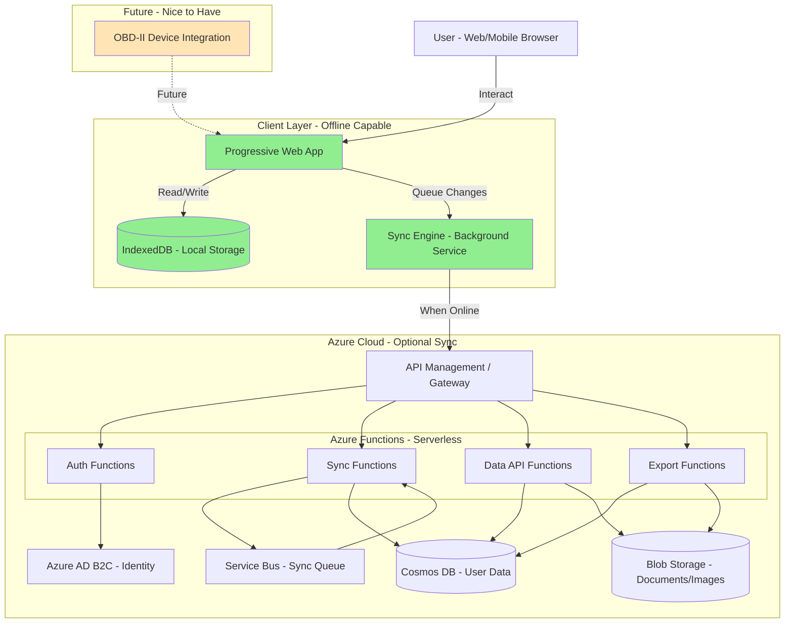

[← Back to Index](./README.md)

# High Level Architecture

## Technical Summary

The Vehicle Lifecycle Tracking Application employs a hybrid architecture combining client-side-first design with optional cloud-backed synchronization. The system follows an offline-first, eventually consistent pattern where the client (web/mobile) acts as the primary data store using IndexedDB, with Azure serverless backend providing synchronization, backup, and cross-device data availability. The architecture leverages serverless microservices on Azure (Functions, Cosmos DB, Blob Storage) to minimize operational overhead and costs while maintaining scalability. Core patterns include event-driven sync, conflict-free replicated data types (CRDT) for eventual consistency, and progressive web app (PWA) capabilities for mobile-like experience on the web. This architecture directly supports the PRD goals of privacy-first operation, offline functionality, and cost-effective cloud usage within Azure free-tier limits.

## High Level Overview

Architectural Style: Offline-First Client with Serverless Backend

The system employs a client-heavy architecture where the web/mobile application maintains full operational capability without backend connectivity. All CRUD operations execute against local IndexedDB storage, providing instant response times and eliminating network dependency.

Repository Structure: Monorepo (recommended for solo development and BMAD demonstration)
- Single repository containing frontend, backend functions, and shared types
- Simplified dependency management and atomic cross-stack changes
- Easier demonstration of BMAD methodology with unified project view

Service Architecture: Serverless Microservices
- Azure Functions for API endpoints (HTTP triggers)
- Event-driven sync processing (Queue triggers)
- Stateless compute aligns with sporadic sync traffic patterns
- Cost-effective for MVP with burst usage patterns

Primary User Interaction Flow:
1. User Input → Local IndexedDB (immediate persistence)
2. Background Process → Sync Queue (when online)
3. Azure Functions → Process sync, detect conflicts, merge changes
4. Cosmos DB → Authoritative cloud storage
5. Blob Storage → Document/receipt image storage
6. Sync Response → Client receives updates from other devices

Key Architectural Decisions:
1. Local-First Storage: IndexedDB provides structured storage with indexing capabilities, supporting complex queries offline. Chosen over localStorage (size limits) and raw file storage (no query capabilities).
2. Azure Cosmos DB: Selected for cloud storage due to global distribution capabilities (future multi-region), flexible schema (JSON documents), and strong consistency options for conflict resolution.
3. Conflict Resolution Strategy: Last-Write-Wins (LWW) with vector clocks for most entities. User-driven resolution for critical conflicts (simultaneous edits to same record from different devices).
4. Authentication: Azure AD B2C for user management, supporting social logins and providing GDPR-compliant user data management.

## High Level Project Diagram

## Architectural and Design Patterns

- Offline-First / Local-First Architecture: Primary pattern for entire application. All data operations succeed without network. Sync is a background enhancement, not a requirement. Rationale: Core PRD requirement (NFR1, NFR2) ensures usability in parking lots, garages, and areas with poor connectivity.
- Event-Driven Synchronization: Sync operations triggered by events (connectivity change, user action, timer). Azure Service Bus queues decouple sync requests from processing. Idempotent sync operations allow retry without duplication. Rationale: Handles unreliable mobile connectivity gracefully; allows batching for efficiency; scales to handle sync bursts when users come online.
- CQRS - Lightweight: Separate sync write path from read path. Optimistic local writes, eventual consistency with cloud. Read-heavy queries against local IndexedDB. Rationale: Optimizes for read performance, simplifies offline operation, allows independent scaling of sync processing.
- Repository Pattern: Abstract data access behind repository interfaces. Repositories handle both IndexedDB and Azure Cosmos DB operations. Rationale: Clean separation of concerns; testable data layer; consistent API regardless of storage backend.
- API Gateway Pattern: Azure API Management as single entry point. Rationale: Centralizes cross-cutting concerns; protects backend functions; enables API versioning; stays within Azure free tier for MVP.
- Saga Pattern (Future OBD-II): Multi-step workflows with compensation logic. Rationale: OBD-II integration involves multiple steps and potential failures.
