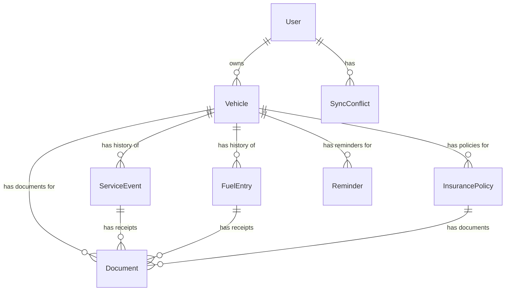

[← Back to Index](./README.md)

# Data Models

Based on the PRD requirements and core features, the following entities form the core data model for the Vehicle Lifecycle Tracking Application.

## User

Purpose: Represents the application user account. Stores minimal user information for privacy-first approach.

Key Attributes:
- id: string (UUID)
- email: string
- displayName: string
- createdAt: DateTime
- updatedAt: DateTime
- preferences: object (distanceUnit, fuelVolumeUnit, currency, locale)
- syncEnabled: boolean
- lastSyncAt: DateTime | null

Relationships:
- One-to-Many with Vehicle
- One-to-Many with SyncConflict

## Vehicle

Purpose: Represents a vehicle tracked by the user.

Key Attributes:
- id: string (UUID)
- userId: string (UUID)
- make: string
- model: string
- year: number
- vin: string | null
- licensePlate: string | null
- nickname: string | null
- currentOdometer: number
- odometerUnit: enum ('miles','kilometers')
- photoUrl: string | null
- purchaseDate: DateTime | null
- purchasePrice: number | null
- notes: string | null
- isActive: boolean
- createdAt: DateTime
- updatedAt: DateTime
- lastSyncedAt: DateTime | null
- _version: number

Relationships:
- Many-to-One with User
- One-to-Many with ServiceEvent, FuelEntry, InsurancePolicy, Document, Reminder

## ServiceEvent

Purpose: Records maintenance and service activities performed on a vehicle.

Key Attributes:
- id: string (UUID)
- vehicleId: string (UUID)
- date: DateTime
- odometer: number
- serviceType: enum
- description: string
- cost: number | null
- shopName: string | null
- shopAddress: string | null
- notes: string | null
- receiptDocumentIds: string[]
- tags: string[]
- createdAt: DateTime
- updatedAt: DateTime
- lastSyncedAt: DateTime | null
- _version: number

Relationships:
- Many-to-One with Vehicle
- One-to-Many with Document (receipts)

## FuelEntry

Purpose: Records fuel purchases and enables fuel economy tracking.

Key Attributes:
- id: string (UUID)
- vehicleId: string (UUID)
- date: DateTime
- odometer: number
- volume: number
- volumeUnit: enum
- costPerUnit: number
- totalCost: number
- isFillUp: boolean
- stationName: string | null
- location: string | null
- fuelGrade: enum | null
- notes: string | null
- receiptDocumentIds: string[]
- createdAt: DateTime
- updatedAt: DateTime
- lastSyncedAt: DateTime | null
- _version: number

Relationships:
- Many-to-One with Vehicle
- One-to-Many with Document (receipts)

## InsurancePolicy

Purpose: Stores vehicle insurance policy information and renewal dates.

Key Attributes:
- id: string (UUID)
- vehicleId: string (UUID)
- provider: string
- policyNumber: string
- startDate: DateTime
- endDate: DateTime
- premium: number | null
- premiumFrequency: enum | null
- coverageType: string | null
- deductible: number | null
- notes: string | null
- documentIds: string[]
- createdAt: DateTime
- updatedAt: DateTime
- lastSyncedAt: DateTime | null
- _version: number

Relationships:
- Many-to-One with Vehicle
- One-to-Many with Document

## Document

Purpose: Stores references to uploaded documents (receipts, manuals, registration, warranty).

Key Attributes:
- id: string (UUID)
- vehicleId: string (UUID)
- filename: string
- mimeType: string
- size: number
- category: enum
- description: string | null
- date: DateTime | null
- localFileKey: string
- cloudBlobUrl: string | null
- thumbnailLocalKey: string | null
- thumbnailCloudUrl: string | null
- linkedEntityType: enum | null
- linkedEntityId: string | null
- tags: string[]
- createdAt: DateTime
- updatedAt: DateTime
- lastSyncedAt: DateTime | null
- _version: number

Relationships:
- Many-to-One with Vehicle
- Optional Many-to-One with ServiceEvent, FuelEntry, InsurancePolicy

## Reminder

Purpose: Manages maintenance reminders based on odometer or calendar dates.

Key Attributes:
- id: string (UUID)
- vehicleId: string (UUID)
- title: string
- description: string | null
- reminderType: enum ('odometer','date','both')
- odometerThreshold: number | null
- dateThreshold: DateTime | null
- advanceNoticeOdometer: number | null
- advanceNoticeDays: number | null
- repeatInterval: number | null
- status: enum ('active','completed','snoozed','dismissed')
- completedAt: DateTime | null
- snoozeUntil: DateTime | null
- linkedServiceType: enum | null
- notes: string | null
- createdAt: DateTime
- updatedAt: DateTime
- lastSyncedAt: DateTime | null
- _version: number

Relationships:
- Many-to-One with Vehicle

## SyncConflict

Purpose: Tracks synchronization conflicts requiring user resolution.

Key Attributes:
- id: string (UUID)
- userId: string (UUID)
- entityType: enum ('vehicle','service','fuel','insurance','document','reminder')
- entityId: string (UUID)
- localVersion: object
- cloudVersion: object
- localTimestamp: DateTime
- cloudTimestamp: DateTime
- conflictDetectedAt: DateTime
- resolutionStrategy: enum | null
- resolvedAt: DateTime | null
- resolvedBy: enum | null
- notes: string | null

Relationships:
- Many-to-One with User

## Data Model Diagram

