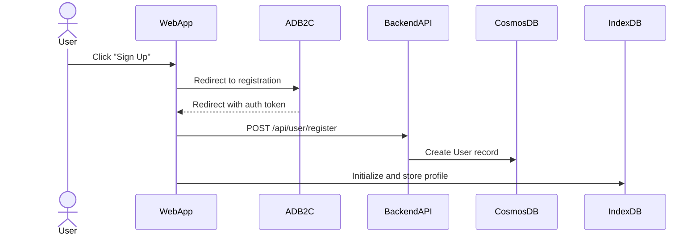
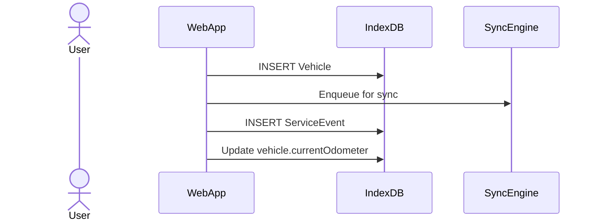
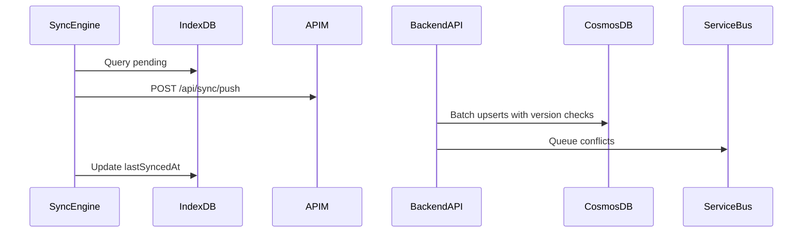
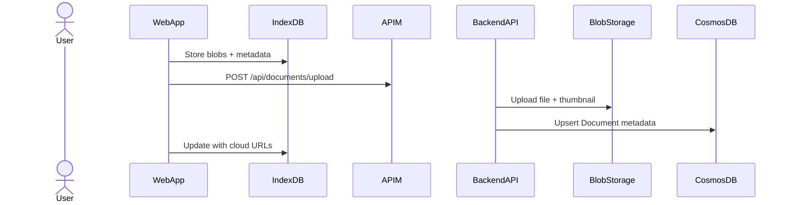
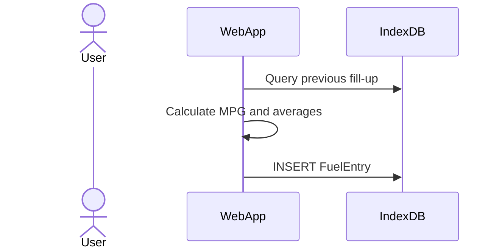

[← Back to Index](./README.md)

# Core Workflows

## Workflow 1: User Registration and First-Time Setup

## Workflow 2: Add Vehicle and First Service Entry (Offline)

## Workflow 3: Background Sync - Push Local Changes

## Workflow 4: Document Upload with Sync

## Workflow 5: Fuel Economy Calculation

