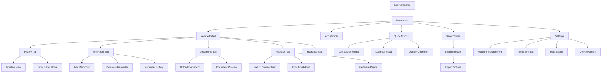
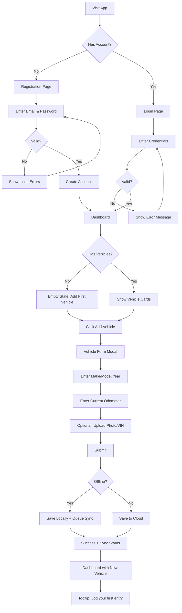
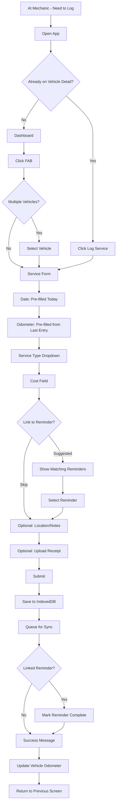
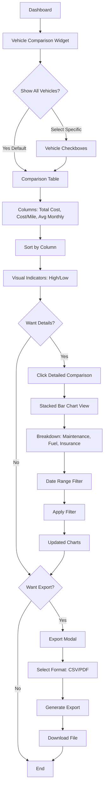
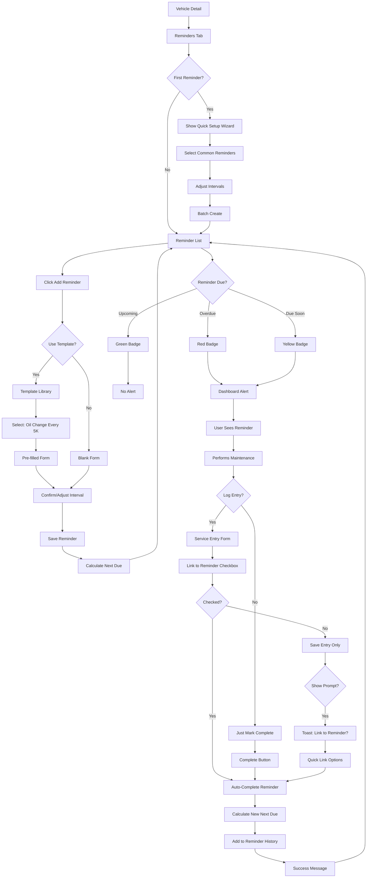

# Vehicle Lifecycle Tracking Application UI/UX Specification

**Version:** 1.0  
**Date:** January 9, 2026  
**Author:** Sally (UX Expert)  
**Status:** Draft

---

## Introduction

This document defines the user experience goals, information architecture, user flows, and visual design specifications for the **Vehicle Lifecycle Tracking Application**'s user interface. It serves as the foundation for visual design and frontend development, ensuring a cohesive and user-centered experience.

### Overall UX Goals & Principles

#### Target User Personas

**Individual Vehicle Owner (Primary):** Adults aged 25-65 who own 1-3 vehicles and want to maintain comprehensive records for personal accountability, resale value, and peace of mind. They experience maintenance anxiety from scattered receipts and forgotten service intervals. Tech-comfortable but not necessarily tech-savvy—they use smartphones daily but prioritize simplicity over features. Primary use case: logging entries in the field (gas station, mechanic parking lot) on mobile devices.

**Multi-Vehicle Manager:** Household decision-makers managing vehicles for family members or small business owners with a small fleet (2-5 vehicles). They need to compare costs across vehicles, track who used which vehicle, and make data-driven repair-vs-replace decisions. Desktop and mobile usage split depending on task: mobile for quick logging, desktop for analysis and reporting.

#### Usability Goals

1. **Speed of Entry:** Users can log a service entry or fuel fill-up in under 30 seconds, even in parking lots on their phones
2. **Offline Reliability:** All core functions work without internet connectivity with transparent sync status—users trust their data is safe locally
3. **Contextual Clarity:** When managing multiple vehicles, users always know which vehicle context they're in without confusion
4. **Cognitive Simplicity:** Key information (upcoming reminders, recent entries, cost trends) is immediately scannable without information overload
5. **Error Prevention:** Destructive actions (delete vehicle, delete account) require confirmation with clear consequences explained
6. **Learnability:** First-time users can add their first vehicle and log an entry within 5 minutes without tutorials

#### Design Principles

1. **Mobile-First, Field-Optimized** - Design for one-handed use in parking lots; large touch targets (44px minimum), thumb-zone optimization, instant local saves
2. **Data-Forward Minimalism** - Clean, uncluttered interfaces that make numbers and dates scannable; progressive disclosure hides complexity until needed
3. **Transparent System Status** - Always show sync status, data freshness, and offline capabilities without technical jargon that confuses users
4. **Contextual Intelligence** - Pre-fill forms with smart defaults (today's date, last odometer reading), suggest next actions based on history
5. **Trust Through Clarity** - Privacy-first messaging, local-first architecture visible to users, no hidden data collection, export options always available

### Change Log

| Date | Version | Description | Author |
|------|---------|-------------|--------|
| 2026-01-09 | 1.0 | Initial UI/UX specification creation | Sally (UX Expert) |

---

## Information Architecture (IA)

### Site Map / Screen Inventory

### Navigation Structure

**Primary Navigation:**  
Bottom navigation bar (mobile) / Sidebar (desktop) with 4 core sections:
- **Dashboard** (Home icon) - Multi-vehicle overview, reminders widget, recent activity
- **Vehicles** (Car icon) - Vehicle list/cards, quick access to vehicle details
- **Search** (Magnifying glass icon) - Global search across all data
- **Settings** (Gear icon) - Account, sync preferences, data management

**Secondary Navigation:**  
Within Vehicle Detail screen, horizontal tab navigation:
- History | Reminders | Documents | Analytics | Insurance

**Contextual Actions:**  
Floating Action Button (FAB) on mobile, prominent button on desktop for primary actions:
- From Dashboard: "Quick Add" expanding to Service/Fuel/Vehicle options
- From Vehicle Detail: Context-specific add (Add Service, Add Reminder, Upload Document depending on active tab)

**Breadcrumb Strategy:**  
Desktop only, above main content area:
- Dashboard > [Vehicle Name] > [Tab Name]
- Search Results > [Entry Type] > Entry Detail
Not used on mobile due to screen space constraints; back button navigation instead

---

## User Flows

### Flow 1: First-Time User Onboarding & Vehicle Setup

**User Goal:** Register an account and add first vehicle to begin tracking

**Entry Points:** Landing page, marketing site, app store listing

**Success Criteria:** User has registered account, added vehicle with photo and current odometer, understands next steps

#### Flow Diagram

#### Edge Cases & Error Handling

- Registration with existing email: Show "Email already registered. Try logging in?"
- Weak password: Inline validation with strength meter
- Photo upload exceeds 5MB: Show error with file size limit
- Offline during registration: Queue account creation, show "Will create account when online"
- Form abandonment: Auto-save draft vehicle data to resume later

**Notes:** First-time experience emphasizes speed over completeness—only make/model/year and odometer are required. Photo and VIN are optional to reduce friction. The empty state provides clear call-to-action guidance.

---

### Flow 2: Quick Service Entry (Mobile - Parking Lot Scenario)

**User Goal:** Log a service event in under 30 seconds while at mechanic's parking lot

**Entry Points:** Dashboard FAB, Vehicle Detail "Log Service" button, Reminder "Mark Complete" action

**Success Criteria:** Service entry saved locally with all critical details, linked to reminder if applicable, user can immediately leave app

#### Flow Diagram

#### Edge Cases & Error Handling

- Invalid odometer (lower than previous): Warning but allow override with confirmation
- Cost field empty: Allow $0 (warranty work)
- Receipt upload fails: Save entry without receipt, retry upload in background
- App crashes mid-entry: Auto-recover draft from local storage on relaunch
- No matching reminders: Skip reminder link, show subtle prompt later

**Notes:** Optimized for speed—only 4 required taps (service type, cost, submit, done). Smart defaults eliminate 2 fields. Receipt upload is entirely optional and doesn't block submission. Offline-first ensures no network delays.

---

### Flow 3: Vehicle Comparison & Cost Analysis (Desktop)

**User Goal:** Compare total cost of ownership across vehicles to decide which to sell

**Entry Points:** Dashboard "Vehicle Comparison" widget, Analytics menu

**Success Criteria:** User sees side-by-side cost metrics, identifies most/least expensive vehicle, exports data for further analysis

#### Flow Diagram

#### Edge Cases & Error Handling

- Only one vehicle: Show message "Add another vehicle to compare costs"
- No cost data yet: Show "Log service and fuel entries to see cost analysis"
- Date range results in no data: Show empty state with suggestion to adjust range
- Export generation fails: Retry with error message, offer to save comparison view instead
- Very large export (1000+ entries): Show progress bar during generation

**Notes:** Desktop-optimized for larger screen and mouse interaction. Emphasizes visual comparison (color coding, charts) over raw numbers. Export functionality supports external analysis in Excel for power users.

---

### Flow 4: Reminder Creation & Completion Workflow

**User Goal:** Set up automatic oil change reminder and mark it complete after service

**Entry Points:** Vehicle Detail Reminders tab, Quick Setup wizard, Reminder template library

**Success Criteria:** Reminder created with correct interval, triggers at appropriate time, completion updates next due date

#### Flow Diagram

#### Edge Cases & Error Handling

- Reminder marked complete but no service logged: Allow but show suggestion to log entry for records
- Multiple matching reminders: Allow user to select which one(s) to complete
- Interval change after creation: Recalculate next due date from current values
- Reminder deleted with completions: Archive history with "(Deleted)" label
- Snooze conflicts with actual due date: Show both values and let user choose

**Notes:** Tight integration between reminders and service logging reduces double-entry. Template library eliminates need to research standard intervals. Quick Setup wizard for new users accelerates initial configuration.

---

## Wireframes & Mockups

### Primary Design Files

**Primary Design Files:** TBD - Recommended: Figma for collaborative design with component library and prototyping

### Key Screen Layouts

#### 1. Dashboard (Mobile)

**Purpose:** Multi-vehicle overview with quick access to critical information and actions

**Key Elements:**
- **Header:** App logo, sync status indicator (icon + text: "Synced" / "Offline" / "Syncing..."), settings gear icon
- **Reminders Widget:** Collapsible card at top showing overdue (red) and due soon (yellow) reminders with count badge. Expandable to show list with "Mark Complete" quick actions
- **Vehicle Cards:** Scrollable grid (2 columns on mobile) with vehicle photo, name/model, current odometer, last service date, upcoming reminder count. Tap to navigate to vehicle detail
- **Quick Actions FAB:** Bottom-right floating button, taps to expand into 3 options: "Log Service", "Log Fuel", "Add Vehicle"
- **Recent Activity Feed:** Chronological list of last 10 entries across all vehicles with type icons, vehicle name, date, brief description
- **Bottom Navigation:** Dashboard (active) | Vehicles | Search | Settings

**Interaction Notes:**
- Pull-to-refresh updates sync status and loads latest data
- Swipe vehicle cards left to reveal quick actions: "View Details", "Log Entry", "Edit"
- Long-press FAB for voice input option (future enhancement placeholder)
- Sync status indicator tap shows detailed sync log modal

**Design File Reference:** [Figma Frame: Dashboard-Mobile]

---

#### 2. Vehicle Detail - History Tab (Mobile)

**Purpose:** Unified timeline view of all lifecycle data for selected vehicle

**Key Elements:**
- **Vehicle Header:** Back button, vehicle photo (small), name/model, current odometer with "Update" link, overflow menu (Edit Vehicle, Delete)
- **Tab Navigation:** History (active) | Reminders | Documents | Analytics | Insurance - horizontal scroll tabs
- **Quick Stats Bar:** 3 tiles showing Total Entries, Total Cost (All-Time), Average MPG - tap to filter timeline
- **Timeline List:** Chronological entries with date separators ("Today", "Yesterday", "Last Week"), entry type icon (wrench, fuel pump, document, insurance), title, key details (cost, odometer, location), expand/collapse chevron
- **Entry Detail Expandable:** Expands inline to show full details, notes, attached receipt thumbnail, "Edit" and "Delete" buttons
- **Timeline Filters:** Floating chip bar above timeline: "All" (active) | "Services" | "Fuel" | "Documents" - horizontal scroll
- **Empty State:** Illustration + "No entries yet. Start by logging a service or fuel fill-up" + "Log Service" button
- **FAB:** Context-specific "+" button opens quick-add menu for current tab

**Interaction Notes:**
- Pull-to-refresh reloads timeline
- Swipe entry left for quick actions: "Edit", "Delete", "Share"
- Tap entry to expand details, tap again to collapse
- Long-press entry for context menu: "Duplicate", "Link to Reminder", "Export"
- Infinite scroll loads 50 entries at a time
- Tap odometer in header opens "Update Odometer" modal

**Design File Reference:** [Figma Frame: Vehicle-Detail-History-Mobile]

---

#### 3. Service Entry Form (Mobile Modal)

**Purpose:** Quick logging of service events with minimal friction

**Key Elements:**
- **Modal Header:** "Log Service" title, close X button
- **Date Field:** Date picker, defaults to today, calendar icon
- **Odometer Field:** Numeric input, pre-filled from last entry + estimated miles based on time since last entry, editable
- **Service Type Dropdown:** Searchable dropdown with common types: Oil Change, Tire Rotation, Brake Service, General Maintenance, Repair, Inspection, Other
- **Cost Field:** Currency input with $ prefix, numeric keyboard on mobile
- **Location/Shop Field:** Text input (optional), autocomplete from previous locations
- **Notes Field:** Multiline text area (optional), collapsed by default, "Add notes" link to expand
- **Receipt Upload:** "Upload Receipt" button (optional), shows thumbnail preview after upload, supports camera capture
- **Link to Reminder:** Checkbox section (optional), only shows if matching reminders exist, displays suggested reminders with radio buttons
- **Primary Action:** Large "Save Service" button at bottom (green, full width)
- **Secondary Action:** "Cancel" text button

**Interaction Notes:**
- Form uses bottom sheet modal on mobile (slides up from bottom)
- Auto-save draft every 5 seconds to prevent data loss
- Service type dropdown shows recently used types at top
- Odometer field shows warning icon if value lower than last entry (with override option)
- Receipt upload triggers native camera or file picker
- Form validation inline with red text under invalid fields
- Submit button disabled until required fields valid
- Success shows toast with "Service logged" + odometer update message, auto-closes modal

**Design File Reference:** [Figma Frame: Service-Entry-Form-Mobile]

---

#### 4. Reminders Tab (Mobile)

**Purpose:** Manage maintenance reminders with clear status indicators

**Key Elements:**
- **Vehicle Header:** Same as History tab
- **Tab Navigation:** History | Reminders (active) | Documents | Analytics | Insurance
- **Add Reminder Button:** "+" button top-right, or "Add Your First Reminder" prominent button for empty state
- **Reminder Groups:** Sectioned by status with headers:
  - **Overdue (Red):** Count badge, entries with days/miles overdue in red text
  - **Due Soon (Yellow):** Within 7 days or 500 miles, amber badges
  - **Upcoming (Green):** Future reminders, green checkmarks
- **Reminder Cards:** Title, description line, next due (date or odometer), interval display, "Complete" button (primary action), "Snooze" and "Edit" icons
- **Reminder History Link:** "View History" text button below lists
- **Empty State:** "No reminders yet. Set up your first reminder to stay on top of maintenance" + template suggestions

**Interaction Notes:**
- Tap "Complete" opens confirmation modal showing reminder details, optionally prompts to log service entry
- Tap "Snooze" opens modal with duration options: 1 week, 2 weeks, 500 mi, 1000 mi, Custom
- Swipe reminder left reveals: "Edit", "Delete", "View History"
- Tap reminder card expands to show full details, past completions count, edit controls
- Pull-to-refresh recalculates reminder statuses based on current odometer
- Add Reminder opens modal with template library or blank form option

**Design File Reference:** [Figma Frame: Reminders-Tab-Mobile]

---

#### 5. Analytics Tab (Desktop)

**Purpose:** Visual cost analysis and fuel economy insights for data-driven decisions

**Key Elements:**
- **Vehicle Header:** Breadcrumb (Dashboard > [Vehicle Name] > Analytics), vehicle info compact bar at top
- **Date Range Selector:** Dropdown with presets: Last 30 Days, Last 3 Months, Last Year, All Time, Custom Range
- **Cost Summary Cards:** 4 metric tiles across top: Total Maintenance, Total Fuel, Grand Total, Cost per Mile - large numbers with trend indicators vs previous period
- **Fuel Economy Chart:** Line chart, X-axis: dates, Y-axis: MPG, data points for each fuel entry with tooltips, average MPG reference line, best/worst markers
- **Maintenance Cost Breakdown:** Pie chart showing percentage by service category, legend with dollar amounts, clicking slice filters history
- **Monthly Cost Trend:** Bar chart showing last 12 months, stacked bars for maintenance (blue) + fuel (green), hover shows breakdown
- **Cost Insights Panel:** Text summary with AI-generated insights: "Your fuel economy improved 8% this quarter" / "Maintenance costs 23% higher than average"
- **Export Actions:** "Generate PDF Report" and "Export to CSV" buttons top-right
- **Related Actions:** "Compare with Other Vehicles" link to comparison view

**Interaction Notes:**
- Charts responsive and interactive with hover tooltips
- Date range changes update all charts simultaneously with loading states
- Pie chart slices clickable to filter and drill down
- Charts support zoom/pan for extensive data
- Export PDF generates report preview before download
- Responsive layout stacks charts vertically on tablet/mobile

**Design File Reference:** [Figma Frame: Analytics-Tab-Desktop]

---

#### 6. Dashboard Comparison Widget (Desktop)

**Purpose:** Side-by-side vehicle cost comparison for ownership decisions

**Key Elements:**
- **Widget Header:** "Vehicle Comparison" title, "View Details" link to full comparison page
- **Comparison Table:** Sortable columns: Vehicle (name + photo thumbnail), Total Cost, Cost/Mile, Avg Monthly, Current MPG, Last Service
- **Visual Indicators:** Color-coded badges (red = highest cost, green = lowest cost) per column
- **Sort Controls:** Column headers clickable to sort ascending/descending with arrow indicators
- **Date Range Filter:** Dropdown above table, affects all cost calculations
- **Action Buttons:** "Export Comparison" button top-right

**Interaction Notes:**
- Table rows clickable to navigate to vehicle detail
- Hover row highlights for clarity
- Sort persists user preference
- Color indicators update dynamically when date range changes
- Mobile version shows cards instead of table (vertical stack)

**Design File Reference:** [Figma Frame: Dashboard-Comparison-Desktop]

---

## Component Library / Design System

### Design System Approach

**Custom Design System with Material Design 3 Inspiration** - Build a lightweight custom system tailored to the application's needs rather than adopting a heavy framework. Draw inspiration from Material Design 3 principles (especially motion and responsive adaptation) but maintain flexibility for vehicle-tracking-specific patterns. Prioritize consistency across mobile and desktop while respecting platform conventions (iOS feel on Safari, Android feel on Chrome).

### Core Components

#### Button Component

**Purpose:** Primary, secondary, and tertiary actions throughout the application

**Variants:**
- **Primary:** Filled button with primary color background, white text - for main actions (Save, Submit, Log Service)
- **Secondary:** Outlined button with primary color border, primary color text - for secondary actions (Cancel, Back)
- **Tertiary:** Text-only button with primary color text - for low-priority actions (Skip, Learn More)
- **Destructive:** Red filled or outlined button for delete/remove actions
- **Icon Button:** Circular button containing only icon (Edit, Delete, More)
- **FAB:** Floating Action Button, circular with elevation shadow, primary color

**States:** Default, Hover (desktop), Pressed/Active, Disabled (50% opacity), Loading (spinner replacing text)

**Usage Guidelines:**
- Use Primary for single call-to-action per screen section
- Mobile: Minimum 44x44px touch target, full-width buttons at bottom of forms
- Desktop: Minimum 36x36px, right-aligned in toolbars
- Loading state shows spinner to prevent double-submission
- Disabled buttons include tooltip explaining why disabled

---

#### Form Input Component

**Purpose:** Data entry fields for vehicle details, service logging, reminders

**Variants:**
- **Text Input:** Single-line text field with label, optional helper text, optional prefix/suffix icons
- **Number Input:** Numeric keyboard on mobile, increment/decrement buttons optional
- **Currency Input:** Number input with $ prefix, auto-formatting with commas
- **Textarea:** Multi-line text input for notes/descriptions
- **Date Picker:** Native date input (mobile) or calendar popover (desktop)
- **Dropdown/Select:** Searchable select with options list, recent items at top
- **Autocomplete:** Text input with suggestion dropdown based on history
- **File Upload:** Button or drag-drop area with preview thumbnails

**States:** Empty, Focused (border highlight + label animation), Filled, Error (red border + error text), Disabled, Read-only

**Usage Guidelines:**
- Labels always visible (no placeholder-only patterns for accessibility)
- Inline validation on blur, real-time for password strength
- Error messages specific and actionable: "Odometer must be greater than 45,230 (your last entry)"
- Auto-focus first field when form opens
- Tab order follows visual top-to-bottom, left-to-right
- Optional fields marked with "(optional)" rather than required with asterisks

---

#### Card Component

**Purpose:** Container for grouped content (vehicle cards, reminder cards, dashboard widgets)

**Variants:**
- **Basic Card:** White background, subtle border, optional shadow
- **Interactive Card:** Hover lift effect (desktop), press feedback (mobile), entire card clickable
- **Compact Card:** Reduced padding for list views
- **Elevated Card:** Stronger shadow for modals or overlays
- **Outlined Card:** Prominent border, no shadow, for secondary content

**States:** Default, Hover (subtle lift + shadow increase), Pressed (slight scale down), Selected (primary color border)

**Usage Guidelines:**
- Vehicle cards: Include thumbnail image, 2-3 key metrics, action buttons
- Reminder cards: Color-coded left border for status (red/yellow/green)
- Dashboard widgets: Title header with action link, content area, optional footer
- Mobile: Full-bleed on small screens, rounded corners on tablets+
- Maintain 16px padding minimum for touch targets

---

#### Modal/Dialog Component

**Purpose:** Focused interactions requiring user attention (forms, confirmations, alerts)

**Variants:**
- **Full Modal:** Centered overlay with backdrop, for complex forms (Add Vehicle, Service Entry)
- **Bottom Sheet (Mobile):** Slides up from bottom, dismissible by swipe down, for quick forms
- **Alert Dialog:** Small centered modal for confirmations, max 2 actions
- **Drawer (Desktop):** Slides in from right side for detail panels

**States:** Opening (slide/fade animation), Open, Closing (reverse animation)

**Usage Guidelines:**
- Backdrop click closes modal unless changes unsaved (show confirmation)
- Escape key closes modal (desktop)
- Focus trap prevents tabbing outside modal
- Bottom sheets easier for one-handed mobile use
- Alert dialogs for destructive actions: clear title, explanation, cancel button always present
- Loading state dims content + shows spinner overlay

---

#### Navigation Component

**Purpose:** Primary navigation structure across app

**Variants:**
- **Bottom Navigation (Mobile):** Fixed bar at bottom, 4 items, icons + labels, active state highlighted
- **Sidebar Navigation (Desktop):** Collapsible left sidebar, icons + labels, nested items for settings
- **Tab Navigation:** Horizontal tabs for related content (Vehicle Detail sections), underline indicator
- **Breadcrumbs (Desktop):** Text links separated by chevrons, last item non-interactive

**States:** Default, Active (primary color fill + label), Disabled (grayed out)

**Usage Guidelines:**
- Bottom nav: Icons must be universally recognizable without labels
- Active state always clear with both color and indicator (not color alone)
- Tab navigation: Use for 2-5 related sections, scrollable on mobile if needed
- Breadcrumbs: Skip on mobile, show only on desktop with sufficient width
- Navigation changes persist across sessions

---

#### Status Badge Component

**Purpose:** Visual status indicators for reminders, sync, alerts

**Variants:**
- **Overdue (Red):** Solid red background, white text, optional icon
- **Due Soon (Yellow/Amber):** Solid amber background, dark text
- **Upcoming (Green):** Solid green background, white text
- **Neutral (Gray):** Gray background for informational badges
- **Sync Status:** Icon + text ("Synced" green, "Offline" gray, "Syncing..." amber with spinner)

**States:** Static (no interaction), Animated (spinner for "Syncing"), Dismissible (close X icon)

**Usage Guidelines:**
- Use consistent colors for status meanings across app
- Include text label, not just color (accessibility)
- Position badges consistently: top-right of cards, inline in lists
- Sync badge in header, always visible but unobtrusive
- Count badges (e.g., "3 overdue") use same color coding

---

#### Chart Component

**Purpose:** Data visualization for analytics (fuel economy, cost trends)

**Variants:**
- **Line Chart:** Time-series data (MPG over time), multiple series support
- **Bar Chart:** Categorical comparisons (monthly costs), stackable
- **Pie Chart:** Proportional breakdown (cost by category), donut variant
- **Stats Card:** Large number with trend indicator (▲ 8% vs last month)

**States:** Loading (skeleton/shimmer), Loaded, Empty (no data message), Error (retry button)

**Usage Guidelines:**
- Responsive: Simplify on mobile (fewer axis labels, larger touch targets)
- Interactive tooltips on hover/tap showing exact values
- Legends below charts on mobile, side on desktop
- Color-blind safe palette (not just red/green)
- Export charts as images included in PDF reports
- Loading skeletons match final chart dimensions

---

#### Empty State Component

**Purpose:** Guide users when no data exists yet

**Variants:**
- **Onboarding Empty State:** Illustration + explanation + primary CTA (Add First Vehicle)
- **Feature Empty State:** Smaller illustration + brief text + action (No reminders yet, Add Reminder)
- **Search/Filter No Results:** Icon + "No results found" + suggestion to adjust filters
- **Error State:** Error icon + explanation + retry button

**States:** Static display

**Usage Guidelines:**
- Always include actionable next step, never just "No data"
- Use friendly, encouraging tone: "Let's add your first vehicle!" vs "No vehicles"
- Illustrations simple and on-brand, not generic stock icons
- Mobile: Reduce illustration size, prioritize CTA button
- Empty states teach app functionality: explain why data matters

---

#### Toast/Snackbar Component

**Purpose:** Brief, non-intrusive feedback messages

**Variants:**
- **Success:** Green background, checkmark icon, "Service logged successfully"
- **Error:** Red background, error icon, "Failed to upload receipt. Retry?"
- **Warning:** Amber background, warning icon, "Odometer seems low. Confirm?"
- **Info:** Blue background, info icon, "Data synced to cloud"

**States:** Appearing (slide up), Visible (4-6 seconds), Dismissing (slide down), Dismissed

**Usage Guidelines:**
- Auto-dismiss after 4-6 seconds unless action button present
- Position bottom-center (mobile) or top-right (desktop)
- Swipe to dismiss on mobile
- Include undo action for destructive operations (Delete vehicle, undo for 10 seconds)
- Stack multiple toasts vertically, newest on top
- Don't obscure primary content or CTAs

---

## Branding & Style Guide

### Visual Identity

**Brand Guidelines:** The Vehicle Lifecycle Tracking Application is a new product without existing brand guidelines. The visual identity should convey **trustworthiness, organization, and data clarity**. The brand personality is professional yet approachable—like a reliable mechanic who explains things clearly, not a slick car salesman.

### Color Palette

| Color Type | Hex Code | Usage |
|------------|----------|-------|
| Primary | #2563EB | Primary buttons, active states, links, brand accent |
| Secondary | #64748B | Secondary text, icons, borders, subtle elements |
| Accent | #0891B2 | Highlights, data visualization accents, info badges |
| Success | #10B981 | Success messages, synced status, upcoming reminders, positive trends |
| Warning | #F59E0B | Due soon reminders, warnings, caution messages |
| Error | #EF4444 | Error messages, overdue reminders, destructive actions, negative trends |
| Neutral 900 | #0F172A | Primary text, headings |
| Neutral 700 | #334155 | Secondary text |
| Neutral 500 | #64748B | Placeholder text, disabled states |
| Neutral 300 | #CBD5E1 | Borders, dividers |
| Neutral 100 | #F1F5F9 | Background surfaces, cards |
| Neutral 50 | #F8FAFC | Page background |
| White | #FFFFFF | Card backgrounds, button text on dark |

**Color Usage Notes:**
- **Primary Blue (#2563EB)** - Professional, trustworthy, not overused (only for CTAs and interactive elements)
- **Success Green (#10B981)** - Specifically chosen for deuteranopia/protanopia color-blind safety
- **Error Red (#EF4444)** - Paired with text labels and icons, never color alone
- **Neutral grays** - Extensive range for data-heavy interfaces without visual fatigue
- **Background hierarchy:** Page (#F8FAFC) → Surface (#F1F5F9) → Card (#FFFFFF) creates depth

### Typography

#### Font Families

- **Primary:** Inter (Google Fonts) - Excellent readability at small sizes, modern sans-serif, optimized for screens
- **Secondary:** Inter (same family for consistency) - Use weight variations instead of font switching
- **Monospace:** JetBrains Mono - For VIN numbers, odometer displays, data tables where character alignment matters

#### Type Scale

| Element | Size | Weight | Line Height | Usage |
|---------|------|--------|-------------|-------|
| H1 | 32px / 2rem | 700 (Bold) | 1.2 (38px) | Page titles (Dashboard, Vehicle Name) |
| H2 | 24px / 1.5rem | 600 (Semi-bold) | 1.3 (31px) | Section headings (History, Analytics) |
| H3 | 20px / 1.25rem | 600 (Semi-bold) | 1.4 (28px) | Card titles, subsection headers |
| H4 | 18px / 1.125rem | 600 (Semi-bold) | 1.4 (25px) | Widget titles, emphasis |
| Body | 16px / 1rem | 400 (Regular) | 1.5 (24px) | Primary body text, form labels |
| Body Small | 14px / 0.875rem | 400 (Regular) | 1.5 (21px) | Secondary text, captions, metadata |
| Caption | 12px / 0.75rem | 400 (Regular) | 1.4 (17px) | Timestamps, helper text, footnotes |
| Button | 16px / 1rem | 500 (Medium) | 1 (16px) | Button labels (all-caps or sentence case) |

**Typography Notes:**
- **Mobile adjustments:** Reduce H1 to 28px, H2 to 22px on screens <640px
- **Numeric data:** Use tabular-nums font feature variant for aligned columns
- **Labels:** Sentence case preferred over all-caps (better readability, less aggressive)
- **Line length:** Max 65-75 characters per line for body text readability
- **Letter spacing:** Default for body, +0.02em for all-caps labels

### Iconography

**Icon Library:** Lucide Icons (formerly Feather Icons) - Open-source, consistent 24px grid, stroke-based style matching modern aesthetic

**Usage Guidelines:**
- **Icon Size Standards:** 24px default, 20px in compact UI (tabs, chips), 48px for empty states
- **Icon + Text Pattern:** Icon left of text with 8px gap, vertically centered
- **Standalone Icons:** Always include ARIA label or tooltip for accessibility
- **Navigation Icons:** Home (house), Car (vehicle), Search (magnifying glass), Settings (gear), Plus (add action)
- **Entry Type Icons:** Wrench (service), Fuel pump (fuel), Document (files), Shield (insurance), Bell (reminders)
- **Status Icons:** Check circle (success), Alert triangle (warning), X circle (error), Info circle (information), Sync arrows (syncing)
- **Color Treatment:** Icons inherit text color by default, use semantic colors (green/amber/red) only for status communication

### Spacing & Layout

**Grid System:** 
- **Desktop:** 12-column grid, 1200px max content width, 24px gutters, 48px margins
- **Tablet:** 8-column grid, 768px breakpoint, 16px gutters, 32px margins  
- **Mobile:** 4-column grid (or stacked single column), 16px gutters, 16px margins

**Spacing Scale (based on 4px):**
- **4px** (0.25rem) - Tight spacing between related text elements
- **8px** (0.5rem) - Icon-to-text gap, chip padding, tight component spacing
- **12px** (0.75rem) - Form field internal padding, button padding vertical
- **16px** (1rem) - Default component spacing, card padding, section gaps
- **24px** (1.5rem) - Section spacing within cards, between form groups
- **32px** (2rem) - Spacing between major sections, modal padding
- **48px** (3rem) - Spacing between page sections, desktop section breaks
- **64px** (4rem) - Large section breaks (desktop only)

**Layout Principles:**
- **Consistent rhythm:** Use spacing scale exclusively, avoid arbitrary px values
- **Breathing room:** Dense data needs generous whitespace to remain scannable
- **Touch targets:** 44x44px minimum for all interactive elements on mobile
- **Content width:** Limit text blocks to 600-700px for comfortable reading
- **Z-index layers:** Page (0) → Cards (1) → Modals (100) → Toasts (200) → Tooltips (300)

---

## Accessibility Requirements

### Compliance Target

**Standard:** WCAG 2.1 Level AA - This is the target compliance level specified in the PRD, ensuring the application is usable by people with diverse abilities including visual, motor, auditory, and cognitive disabilities.

### Key Requirements

#### Visual

**Color contrast ratios:**
- Normal text (Body 16px, Small 14px): Minimum 4.5:1 contrast ratio against background
- Large text (H1-H3, 18px+ bold): Minimum 3:1 contrast ratio
- Interactive elements (buttons, links, form borders): Minimum 3:1 contrast ratio
- Status indicators: Never rely on color alone—pair with icons and text labels
- Tested palette combinations: All defined colors meet requirements (Primary #2563EB on white = 8.6:1, Success #10B981 on white = 3.4:1 for large text only)

**Focus indicators:**
- Visible focus outline on all interactive elements: 2px solid primary color (#2563EB) with 2px offset
- Focus order follows logical reading order: top-to-bottom, left-to-right
- Skip-to-content link available for keyboard users to bypass navigation
- Modal focus trapping prevents tabbing outside active dialog
- Custom focus styles maintain visibility on all backgrounds

**Text sizing:**
- All text sizes use relative units (rem) to respect user browser text size preferences
- Layout remains functional at 200% zoom (WCAG requirement)
- No horizontal scrolling required at 200% zoom on viewport width 1280px
- Mobile text sizes maintain readability without pinch-to-zoom

#### Interaction

**Keyboard navigation:**
- All interactive elements reachable via Tab key (forms, buttons, links, cards with actions)
- Dropdowns/selects operable with arrow keys and Enter/Space
- Modals dismissible with Escape key
- Tab navigation order logical and predictable
- No keyboard traps (focus can always move away from any component)
- Shortcuts for power users: '/' to focus search, 'N' for new entry (when implemented, with visible shortcut legend)

**Screen reader support:**
- Semantic HTML elements used correctly (nav, main, section, article, header, footer)
- All images have alt text (vehicle photos descriptive: "2018 Toyota Camry", icons decorative: alt="")
- ARIA labels on icon-only buttons: "Edit vehicle", "Delete entry", "Add service"
- ARIA live regions for dynamic content: Toast messages, sync status updates, loading states
- Form inputs associated with labels via for/id or aria-labelledby
- Landmark roles for major page sections when semantic HTML insufficient
- Heading hierarchy follows logical structure (H1 page title, H2 sections, H3 subsections)

**Touch targets:**
- Minimum 44x44px touch target size on mobile for all interactive elements
- Adequate spacing between adjacent targets (minimum 8px) to prevent mis-taps
- Swipe gestures provide alternative to small buttons (swipe entry card for actions)
- No hover-dependent functionality—all features accessible via touch/tap
- Long-press actions indicated visually (subtle highlight or instruction on first use)

#### Content

**Alternative text:**
- Vehicle photos: Descriptive alt text including make/model/year: "2020 Honda Civic front view"
- Receipt images: Alt text indicates content type: "Service receipt from Bob's Auto, dated March 15, 2025"
- Charts/graphs: Alt text summarizes key insight: "Line chart showing MPG declining from 32 to 28 over 6 months"
- Complex charts include accessible data tables or text summaries
- Icon buttons: ARIA label describes action: "Delete service entry", not just "Delete"

**Heading structure:**
- H1: Page title (Dashboard, Vehicle Name)
- H2: Major sections (Reminders Widget, Vehicle History, Analytics)
- H3: Subsections (Overdue Reminders, Monthly Cost Trend)
- H4: Minor headings (Widget titles, card headers)
- No heading level skipped (no H1 → H3 without H2)
- Headings describe content accurately for screen reader navigation

**Form labels:**
- All form inputs have visible, persistent labels (no placeholder-only patterns)
- Labels associated with inputs via for/id attributes or wrapping
- Required fields indicated with "(required)" text, not just asterisk
- Optional fields marked "(optional)" for clarity
- Error messages associated with fields via aria-describedby
- Multi-step forms indicate progress: "Step 2 of 3: Service Details"

### Testing Strategy

**Automated Testing:**
- Axe accessibility testing integrated into CI/CD pipeline (fails build on WCAG AA violations)
- Lighthouse accessibility audits on every deployment (minimum score: 90/100)
- ESLint plugin jsx-a11y for React accessibility linting during development
- Pa11y CI for automated regression testing on key user flows

**Manual Testing:**
- Keyboard-only navigation testing on all user flows (onboarding, service logging, reminder creation)
- Screen reader testing with NVDA (Windows), JAWS (Windows), VoiceOver (iOS/Mac)
- Color contrast verification with tools like WebAIM Contrast Checker
- Browser zoom testing up to 200% on Chrome, Firefox, Safari
- Touch target testing on actual mobile devices (not just emulators)

**Assistive Technology Testing Matrix:**
| Platform | Screen Reader | Browser | Frequency |
|----------|--------------|---------|-----------|
| Windows | NVDA | Chrome | Every release |
| Windows | JAWS | Edge | Major releases |
| Mac | VoiceOver | Safari | Every release |
| iOS | VoiceOver | Safari | Every release |
| Android | TalkBack | Chrome | Major releases |

**User Testing:**
- Include users with disabilities in usability testing sessions
- Specifically test with users who rely on: keyboard-only navigation, screen readers, high contrast modes, zoom/magnification
- Document accessibility issues raised as high-priority bugs

**Remediation Process:**
- WCAG AA violations are release blockers
- Accessibility bugs triaged same as functional bugs
- Developers trained on accessibility best practices
- UX reviews include accessibility checklist

---

## Responsiveness Strategy

### Breakpoints

| Breakpoint | Min Width | Max Width | Target Devices |
|------------|-----------|-----------|----------------|
| Mobile | 0px | 639px | Smartphones (iPhone SE to iPhone 15 Pro Max, Android phones) |
| Tablet | 640px | 1023px | Tablets (iPad, iPad Mini, Android tablets), small laptops in portrait |
| Desktop | 1024px | 1439px | Laptops, desktop monitors, tablets in landscape |
| Wide | 1440px | - | Large desktop monitors (1440p, 4K), ultra-wide displays |

**Breakpoint Strategy:**
- **Mobile-first development:** Base styles for mobile, progressive enhancement for larger screens
- **Tailwind CSS breakpoints:** sm: 640px, md: 768px, lg: 1024px, xl: 1280px, 2xl: 1536px (standard framework approach)
- **Test on real devices:** Primary testing on iPhone 12/13 (390px), iPad (768px), MacBook (1440px)
- **Fluid between breakpoints:** Use percentage widths and flexible grids, not fixed pixel layouts

### Adaptation Patterns

**Layout Changes:**

**Mobile (0-639px):**
- Single column layouts, stacked content
- Full-width cards and forms
- Collapsible sections to conserve vertical space
- Bottom navigation bar (fixed position)
- FAB for primary actions (bottom-right)
- Modals use full-screen or bottom sheet patterns
- Vehicle cards in 1 column list or 2-column grid
- Charts simplified: fewer axis labels, larger touch targets

**Tablet (640-1023px):**
- 2-column grids for vehicle cards
- Side-by-side layout for form + preview
- Sidebar navigation appears (collapsible)
- Modals centered with max-width, not full screen
- Tab navigation horizontal with all tabs visible
- Charts show full details with desktop interaction patterns
- Bottom navigation transitions to sidebar at 768px

**Desktop (1024px+):**
- Multi-column layouts: sidebar + main content + right panel (analytics view)
- Hover states activate (tooltips, button highlights)
- Breadcrumb navigation appears
- Modal max-width 600px for forms, 900px for complex content
- Data tables replace card lists for dense information
- Vehicle comparison side-by-side (3-4 vehicles)
- Split-screen patterns: vehicle list left, details right

**Wide (1440px+):**
- Max content width 1200px (centered with margins)
- Increased padding and whitespace
- Larger charts with more data points visible
- Dashboard can show 3-4 columns of widgets
- No horizontal scrolling needed for any content

---

**Navigation Changes:**

**Mobile:**
- Bottom navigation bar: 4 primary items (Dashboard, Vehicles, Search, Settings)
- Hamburger menu for overflow items (if needed post-MVP)
- Vehicle selector as dropdown in header (when in vehicle context)
- Back button in header for nested navigation
- Tabs horizontal scroll if >4 items

**Tablet:**
- Bottom navigation transitions to left sidebar at 768px
- Sidebar collapsible to icon-only mode
- Vehicle selector remains in header
- Tabs all visible (5-6 items fit)
- Breadcrumbs appear on larger tablets (900px+)

**Desktop:**
- Full sidebar navigation (always visible or collapsible)
- Vehicle selector in sidebar with thumbnail and quick switch
- Breadcrumbs in content area
- Secondary navigation (tabs) uses full horizontal space
- Keyboard shortcuts available (displayed in menu)

---

**Content Priority:**

**Mobile Content Strategy:**
- **Essential info first:** Key metrics, critical alerts, primary actions
- **Progressive disclosure:** Details hidden behind taps/expands
- **Prioritized vehicle data:** Odometer, last service, overdue reminders visible; full details on tap
- **Simplified charts:** Show trend direction and key insight, not every data point
- **Condensed tables:** Key columns only, drill-down for full details
- **Truncated text:** With "Read more" expansion for long notes

**Desktop Content Strategy:**
- **All details visible:** No artificial hiding, users have screen space
- **Data tables:** Full column sets with sorting, filtering inline
- **Multi-panel layouts:** Vehicle list + selected vehicle details + quick actions
- **Comprehensive charts:** All data points, hover tooltips, zoom controls
- **Side-by-side comparisons:** Compare 3-4 vehicles simultaneously
- **Expanded forms:** Multi-column layouts for efficiency

**Content Adaptation Rules:**
1. **Never hide critical functionality** on mobile—adapt presentation, not remove features
2. **Simplify, don't eliminate:** Mobile charts show key insight, desktop shows all data
3. **Contextual intelligence:** Pre-select single vehicle on mobile if user has only one
4. **Consistent mental model:** Same information hierarchy across devices, different density

---

**Interaction Changes:**

**Mobile Interactions:**
- **Touch-first:** 44px minimum touch targets, generous spacing
- **Swipe gestures:** Swipe entry cards left for Edit/Delete actions
- **Pull-to-refresh:** Updates data and sync status
- **Bottom sheets:** Form modals slide from bottom (easier thumb access)
- **Long-press:** Context menus and quick actions
- **Tap to expand:** Timeline entries, cards, collapsed sections
- **Fixed elements:** Navigation bar at bottom, header at top (both always accessible)
- **Auto-save drafts:** Forms save progress locally (handles app backgrounding)

**Tablet Interactions:**
- **Hybrid touch/mouse:** Support both interaction models
- **Hover states:** Optional tooltips and hover effects
- **Larger tap targets:** 36-44px range (some users may use mouse)
- **Swipe gestures:** Still supported but not required
- **Modals:** Centered overlays, dismissible by backdrop click
- **Keyboard support:** Enhanced for tablet keyboard accessories

**Desktop Interactions:**
- **Mouse-optimized:** Hover effects, right-click context menus
- **Keyboard shortcuts:** Efficient navigation and actions
- **Precise interactions:** Smaller click targets acceptable (mouse precision)
- **Multi-select:** Shift+click, Ctrl+click for bulk operations
- **Drag-and-drop:** Reorder items, upload files
- **Hover tooltips:** Additional information without clicks
- **Focus management:** Clear focus indicators for tab navigation

**Interaction Consistency:**
- **Core actions identical:** Add service flow same on all devices (fields may reflow)
- **No device-exclusive features:** Everything available everywhere (adapted appropriately)
- **Fallback patterns:** Hover states have tap equivalents, keyboard shortcuts have menu equivalents

---

## Animation & Micro-interactions

### Motion Principles

**Purposeful, Not Decorative** - Every animation serves a functional purpose: providing feedback, guiding attention, expressing relationships between elements, or maintaining context during transitions. Animations should feel snappy and responsive, never sluggish or gratuitous.

**Performance-First** - All animations use GPU-accelerated properties (transform, opacity) to maintain 60fps. Avoid animating layout properties (width, height, top, left) that trigger expensive reflows. Respect user preferences with `prefers-reduced-motion` media query.

**Consistent Timing** - Use standardized durations and easing curves across the application to create a cohesive feel. Fast animations (100-200ms) for micro-interactions, medium (200-300ms) for state changes, slower (300-500ms) for page transitions.

**Responsive Motion** - Animation durations scale appropriately: slightly faster on mobile (snappier feel), standard on desktop. Complex animations can be simplified or disabled on low-powered devices.

### Key Animations

- **Button Press Feedback:** Scale down to 0.95 on active state (100ms), spring back on release (150ms ease-out). Provides tactile feedback especially critical on touchscreens.

- **Card Hover (Desktop):** Translate Y by -4px and increase shadow on hover (200ms ease-out). Signals interactivity and adds depth. No animation on mobile (touch devices have no hover state).

- **Modal Entry/Exit:** Modal fades in (opacity 0→1, 200ms) while backdrop fades in (opacity 0→0.5, 200ms). Bottom sheets slide up from bottom edge (transform translateY(100%)→0, 300ms ease-out). Exit reverses animations slightly faster (200ms).

- **Toast/Snackbar:** Slide up from bottom (mobile) or slide in from top-right (desktop) with fade (transform + opacity, 300ms ease-out). Auto-dismiss after 4-6s with fade + slide out (200ms). Swipe gesture on mobile for instant dismiss.

- **FAB Expansion:** FAB rotates 45° (transforms into X icon) while action menu items slide out in sequence with stagger (50ms delay between items, 200ms duration each, spring easing). Creates playful reveal.

- **Tab Switch:** Active tab indicator slides horizontally to new position (300ms ease-in-out) with content fade transition (200ms cross-fade). Maintains spatial relationship between tabs.

- **Loading States:** Skeleton screens shimmer with gradient sweep (1500ms infinite, linear) or spinner rotates (1000ms infinite, linear). Pulsing dot indicators for sync status (1200ms infinite, ease-in-out).

- **List Item Add/Remove:** New items scale in from 0.8 to 1.0 with fade (300ms ease-out). Removed items fade and scale to 0.8 (200ms) then collapse height (200ms ease-out). Other items slide to fill space (300ms ease-in-out).

- **Form Validation:** Error state animates with subtle shake (translate X ±4px, 3 cycles, 400ms total). Success state shows checkmark scale in with bounce (300ms ease-out spring).

- **Pull-to-Refresh:** Loading indicator scales and fades in as user pulls down. Release triggers rotation animation (1000ms infinite) until data loaded. Completion shows checkmark briefly before dismissing.

- **Chart Entry Animations:** Data points/bars stagger in on first load (50ms delay per item, 500ms duration, ease-out). Draws attention to data without excessive flourish. Subsequent updates use simple fade (200ms).

- **Page Transitions:** Fade current page out (150ms) → Load new content → Fade new page in (200ms). Maintains continuity without jarring cuts. Optional slide transitions for hierarchical navigation (child pages slide in from right, back gesture slides from left).

- **Focus Animations:** Focus ring fades in (100ms) and slightly scales element (1.02, 100ms ease-out). Keyboard users get clear visual feedback without sudden appearance.

---

## Performance Considerations

### Performance Goals

- **Page Load:** First Contentful Paint (FCP) under 1.5s, Time to Interactive (TTI) under 3s on 4G connection
- **Interaction Response:** Form inputs, button clicks respond within 100ms (perceived as instant), complete actions within 500ms
- **Animation FPS:** Maintain 60fps (16.67ms per frame) for all animations and scrolling on modern devices, degrade gracefully on older hardware

### Design Strategies

**Lazy Loading & Code Splitting:**
- Defer loading of non-critical screens (Analytics, Settings) until user navigates to them
- Load chart libraries only when analytics tab accessed (reduces initial bundle size)
- Lazy load vehicle photos with blur-up technique (small placeholder → full resolution)
- Infinite scroll on long lists (vehicle history, fuel entries) loads 50 items at a time

**Image Optimization:**
- Serve responsive images with srcset (multiple resolutions for different viewport sizes)
- WebP format with JPEG fallback for broader compression (30-50% smaller than JPEG)
- Vehicle photos: 400px thumbnail for cards, 800px for detail view, 1600px for full-screen
- Compress images to balance quality and size: ~80% quality sweet spot
- Lazy load images below the fold with Intersection Observer API

**Offline-First Architecture:**
- IndexedDB stores all user data locally—reads are instant, no network latency
- Service Worker caches app shell (HTML, CSS, JS) for near-instant repeat visits
- Background sync queues writes for eventual upload—users never wait for network
- Optimistic UI updates: show success immediately, rollback if sync fails

**Critical Rendering Path:**
- Inline critical CSS in HTML head (above-the-fold styles) for immediate render
- Defer non-critical CSS (analytics, rarely-used components)
- Load JavaScript asynchronously or defer to prevent render blocking
- Preload key assets (fonts, logo, primary button graphics) with <link rel="preload">

**Bundle Size Optimization:**
- Tree-shake unused code with modern build tools (Webpack, Vite)
- Split vendor bundles: React/core libraries separate from application code
- Compress JavaScript with Brotli or Gzip (typically 70-80% reduction)
- Remove unused CSS with PurgeCSS (especially important with Tailwind)
- Target bundle sizes: <200KB initial load (gzipped), <50KB per lazy-loaded route

**Database Query Optimization:**
- Index frequently queried fields in IndexedDB (vehicle_id, date, user_id combinations)
- Cursor-based pagination for large result sets
- Compound indexes for complex queries (vehicle_id + date range)
- Cache aggregated data (total costs, average MPG) rather than recalculating on every load

**State Management Efficiency:**
- Normalize Redux state to avoid duplication (single source of truth for vehicle data)
- Memoize expensive selectors with Reselect (cost calculations, filtered lists)
- Debounce search inputs (300ms delay before triggering search)
- Throttle scroll handlers for infinite scroll (200ms intervals)

**Rendering Optimization:**
- Virtualize long lists (React Window or similar) to render only visible items
- Memoize React components with React.memo to prevent unnecessary re-renders
- Use keys properly in lists to enable efficient reconciliation
- Skeleton screens show immediately while data loads (perceived performance boost)

**Font Loading Strategy:**
- Use font-display: swap to prevent invisible text during font load
- Subset fonts to include only Latin characters (reduces file size)
- Preload font files for critical text (Inter Regular and Bold)
- Consider system font stack as fallback for instant render

**Third-Party Scripts:**
- Minimize third-party dependencies (analytics, monitoring) or load asynchronously
- Self-host dependencies when possible to avoid external network requests
- No ad networks, trackers, or unnecessary analytics (privacy-first principle)

**Progressive Web App (PWA) Optimization:**
- Service Worker caches all static assets aggressively
- App shell architecture: skeleton loads instantly, content fills in
- Background sync for reliable data synchronization
- Push notifications for reminder alerts (optional, user opt-in)

**Monitoring & Measurement:**
- Real User Monitoring (RUM) via lightweight instrumentation (measure actual user experience)
- Core Web Vitals tracking: LCP, FID, CLS as key metrics
- Error tracking without heavy client-side agents
- Performance budgets enforced in CI/CD: fail build if bundle exceeds thresholds

---

## Next Steps

### Immediate Actions

1. **Stakeholder Review** - Share this UI/UX specification with the PM (John) and project stakeholders for feedback on user flows, design principles, and scope alignment
2. **Create Visual Designs** - Begin high-fidelity mockups in Figma for the 6 key screens identified (Dashboard Mobile, Vehicle Detail, Service Entry Form, Reminders Tab, Analytics Desktop, Comparison Widget)
3. **Component Prototyping** - Build interactive prototypes for critical flows (onboarding, quick service entry, reminder completion) to validate 30-second logging goal
4. **Accessibility Audit Planning** - Schedule accessibility review sessions with users who rely on assistive technologies
5. **Prepare for Architecture Handoff** - Package this specification with PRD and design files for the Design Architect to begin technical planning

### Design Handoff Checklist

- [x] All user flows documented
- [x] Component inventory complete
- [x] Accessibility requirements defined
- [x] Responsive strategy clear
- [x] Brand guidelines incorporated
- [x] Performance goals established
- [ ] High-fidelity mockups created in Figma
- [ ] Interactive prototypes built for key flows
- [ ] Design system components documented with variants and states
- [ ] Icon library selected and assets prepared
- [ ] Accessibility testing plan defined
- [ ] Handoff documentation prepared for developers

---

## Document Completion Summary

This UI/UX specification provides a comprehensive foundation for the Vehicle Lifecycle Tracking Application's user interface design and user experience. Key deliverables include:

✅ **UX Goals & Principles** - Defined target personas (Individual Vehicle Owner, Multi-Vehicle Manager), usability goals (30-second entry, offline reliability, contextual clarity), and 5 core design principles

✅ **Information Architecture** - Complete site map with 30+ screens/views, 4-item primary navigation, tab-based vehicle detail structure, and clear breadcrumb strategy

✅ **User Flows** - 4 critical flows documented with Mermaid diagrams: onboarding, quick service entry, cost comparison, and reminder workflow—all addressing real-world scenarios from the PRD

✅ **Wireframes & Key Layouts** - 6 detailed screen layouts spanning mobile and desktop with interaction notes and design file references

✅ **Component Library** - 9 core components defined (Button, Form Input, Card, Modal, Navigation, Badge, Chart, Empty State, Toast) with variants, states, and usage guidelines

✅ **Branding & Style** - Complete color palette (13 colors), typography system (Inter font with 8-level type scale), iconography guidelines (Lucide Icons), and spacing scale

✅ **Accessibility Requirements** - WCAG 2.1 Level AA compliance target with detailed visual, interaction, and content requirements plus comprehensive testing strategy

✅ **Responsive Strategy** - 4 breakpoints (Mobile/Tablet/Desktop/Wide) with adaptation patterns for layout, navigation, content priority, and interactions

✅ **Animation & Motion** - Motion principles and 13 key animations (100-500ms timing) with performance-first approach and prefers-reduced-motion support

✅ **Performance Considerations** - Specific goals (FCP <1.5s, interactions <500ms, 60fps animations) and 10+ optimization strategies

**Ready for next phase:** This specification is ready for the Design Architect to begin technical architecture planning, focusing on offline-first implementation, React component structure, IndexedDB schema, and Azure deployment strategy as outlined in the PRD.

---

**Document Status:** Complete  
**Last Updated:** January 9, 2026  
**Next Phase:** Technical Architecture Design

